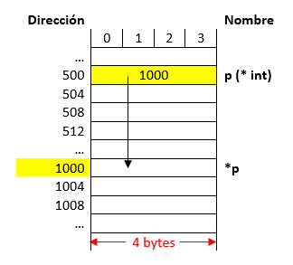
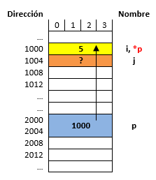
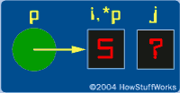
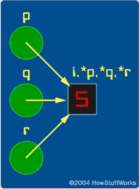

---
jupytext:
  cell_metadata_filter: -all
  formats: md:myst
  text_representation:
    extension: .md
    format_name: myst
    format_version: 0.13
    jupytext_version: 1.11.5
kernelspec:
  display_name: Python 3
  language: python
  name: python3
---

# Apuntadores y arreglos

```{admonition} Objetivos
* Conocer y utilizar los apuntadores para el uso eficiente de la memoria.
* Presentar el uso de las funciones y establecer cómo se realiza el paso de parámetros a funciones.
* Conocer y aplicar el concepto de arreglos de una y más dimensiones en la resolución de problemas mediante algoritmos.
* Conocer cómo es posible asignar de forma eficiente espacio en memoria.
```

## 1. Conceptos previos - ¿Que sucede cuando se declara una variable?

Cuando una variable se declara esta pasa a ocupar un lugar de memoria cuyo tamaño dependerá del número de bytes asociados al tipo de dato con el cual esta se declara. Suponiendo que se tienen las siguientes instrucciones en C:

```{code-block} c
int i;
i = 35;
```

La siguiente figura ilustra su representación en memoria:

```{figure} ./local/img/CH_02-S02-fig1.png
Representación de una variable en memoria.
```

Desde el punto de vista del mapa de memoria y suponiendo que una variable tipo int ocupa 4 bytes tenemos el siguiente resultado por instrucción:

|Instrucción|Representación en memoria|
|----|----|
|`int i;`||
|`i = 35;`||


Como se puede ver en la figura anterior, lo que se modifica cuando se hace manipulación sobre variables es el contenido almacenado en un lugar especifico de memoria. Entender esto es de vital importancia para manejar el próximo tema.

## 2. Entrando en materia - Algunos aspectos sobre los apuntadores

### 2.1. ¿Que es un apuntador?

Un apuntador es una variable que almacena una **dirección de memoria y no un valor** como ocurre en el caso de las variables normales. La siguiente tabla resalta este hecho:

|Instrucciones|Mapa de memoria|
|----|----|
|`int *p;`<br>`p = 1000;`<br><br>**Nota**: Supóngase que el apuntador `p` se encuentra en la posición 500||
|`int *p;`<br>`p = 1000;`<br><br>**Nota**: Supóngase que la variable `p` se encuentra en la posición 500  ||


Como se puede notar en la figura anterior, cuando el valor almacenado en el apuntador hará referencia a la dirección 1000 y no al valor de 1000, esto nos permitirá acceder a dicho lugar de memoria desde el apuntador. Más tarde veremos cómo. Así mismo, como un apuntador guarda una dirección de memoria y teniendo en cuenta que para el ejemplo se supone una arquitectura en la cual se manejan 32 bits ( equivalentes a 4 bytes), esto hará que una variable tipo apuntador sin importar el tipo de dato al que apunte tenga un tamaño de 4 bytes. (Este tamaño se define por la arquitectura. Por ejemplo si la maquina es de 64 bits entonces el tamaño ocupado por una variable tipo apuntador será de 8 bytes).

### 2.2. ¿Como se declara un apuntador?

Un apuntador se declara de la siguiente manera (donde las cosas que se encuentran entre corchetes son opcionales):

```{code-block} c
tipo *[modificadores_del_tipo] nombre [=valor inicial];
```

Dónde:
* **Tipo**: Tipo de dato al cual se desea apuntar, puede ser un tipo de dato simple (`char`, `int`, etc.) o un tipo de dato complejo como una estructura).
* **Modificadores del tipo**: Puede contener cualquier combinación de los modificadores de tipo `const`, `volatile` y `restrict`.
* **Nombre**: Nombre del apuntador.
* **Valor inicial**: Valor inicial del apuntador. 

La siguiente figura muestra esto lo anterior en términos del mapa de memoria:

|Instrucciones|Mapa de memoria|
|----|----|
|`short i = 5;` <br> `short *ptr = &i;`<br> <br> **Nota**: <ul> <li>El tamaño de una variables short es de 2 bytes.</li> <li>El tamaño de una variable tipo apuntador es de 4 bytes.</li> <li>En el dibujo del mapa de memoria cada dirección aumenta de 1 en 1</li> </ul> ||

Como se puede notar en la figura anterior, lo que se guarda en el apuntador es la dirección base (dirección del byte de menor peso) de la variable a la cual se apunta. Para el caso anterior, la variable `i` ocupa 2 bytes (`103` y `104`) sin embargo, en el apuntador se almacena la parte menos correspondiente al byte pesado (byte `103`). 

Si observa la segunda instrucción anteriormente mostrada, la forma como se obtuvo la dirección de `i` fue por medio del operador dirección (`&`) antepuesto a la variable. La siguiente tabla se llena con base en la figura anterior:


| Expresión	| Significado |	Valor |
|-----------|-------------|-------|
|`i`	| Contenido de `i`	|`5`|
|`&i`	| Dirección de `i`	|`103`|
|`p`	| Contenido del apuntador `p`	|`103`|
|`&p`	| Dirección del apuntador `p`	|`106`|

Note en la tabla anterior y la figura previa que con & lo que se obtiene es dirección base de una variable no importa su tipo ya sea una variable normal (`char`, `int`, `float`, etc), apuntador u otro. A continuación se muestra una forma simplificada (tomada de la sección **Pointers basics** de [How Stuff Works](https://computer.howstuffworks.com/c22.htm)) para visualizar los apuntadores y las variables comunes de manera gráfica sin tener que recurrir al bosquejo del mapa de memoria previamente realizado. 


```{figure} ./local/img/CH_02-S02-fig7.png
---
name: mem_ptr
---
Vista simplificada con variables y apuntadores.
```

Note la diferencia en la gráfica, en el dibujo el circulo representa una variable tipo apuntador y como tal almacena una dirección de memoria, la de `i` para el caso (103); por otro lado el vinculo entre el apuntador y la variable se representa por medio de la flecha. Finalmente, el contenido de la variable puede ser accedido o manipulado desde el símbolo `i`, o desde al desreferenciar el apuntador (usando `*ptr`), pero este sera un tema a tratar después.

Una forma aun mas simplificada e incluso mas conveniente al momento de hacer pruebas de escritorio se muestra a continuación. En esta solo se resalta el vinculo del apuntador con la variable:

```{figure} ./local/img/CH_02-S02-fig8.png
---
name: mem_ptr
---
Vista aun mas simplificada con variables y apuntadores.
```

### 2.3. Manipulación de memoria mediante apuntadores

Una de las aplicaciones más importantes es el acceso directo a memoria para su manipulación. Para ello, se manejan dos operadores importantes los cuales el operador referencia (&) y el operador des-referencia (*).

#### 2.3.1. Referenciar un apuntador

Consiste en asociar el apuntador a una dirección específica (durante la declaración o después de esta), para esto se suele usar el operador & para obtener la dirección de la variable en cuestión. A continuación se muestra la forma como normalmente se hace esto:

```{code-block} c
apuntador = &variable;
```

También es posible referenciar un apuntador pasándole el valor que se tiene en otro apuntador. Note que no se hizo uso del operador & en este caso:

```{code-block} c
apuntador = &variable;
```

Todo apuntador debe inicializarse antes de usarse. Si esto no se hace, cuando intente usarlo para hacer alguna operación en memoria el programa sacara un error. Un puntero que no ha sido inicializado se conoce como **Wild pointer**.

#### 2.3.2. Des-referenciar un apuntador
Para poder acceder al lugar de memoria que está siendo apuntado por el puntero y realizar operaciones de lectura y escritura sobre esta dirección de memoria se debe des-referenciar el apuntador. Para ello se hace uso del operador des-referencia (*) después de la declaración del apuntador. El contenido del lugar de memoria apuntado (lectura) se obtiene de la siguiente manera:

```{code-block} c
variable = *apuntador;
```

Ahora si lo que se desea hacer es escribir en el lugar de memoria apuntado se hace lo siguiente:

```{code-block} c
*apuntador = variable;
```

#### 2.3.3. Ejemplos

1. Suponga que se tiene el siguiente fragmento de código fuente:
   
   ```{code-block} c
   #include <stdio.h>

   int main() {
     int i,j;
     int *p; //Apuntador a un entero
     p = &i;
     *p = 5;
     return 0;
   }
   ```

   También tenga en cuenta lo siguientes enunciados:
   * Suponga que `i` y `j` son de `4` bytes y ocupan las direcciones base `1000` y `1004`.
   * El apuntador `p` ocupa las direccione base `2000`.
   * Así mismo la arquitectura es de `64` bits por lo que el espacio ocupado por el apuntador sera de `8` bytes.

   Muestre la ejecución paso a paso del código anterior resaltando la evolución en memoria.

   **Solución**: Las instrucciones que se están evaluando en un momento dado se resaltan en la siguiente tabla:

   |Instrucciones ejecutadas|Contenido del mapa de memoria|Visualización al estilo HowStuffWorks|
   |---|---|---|
   |`int i,j;` <br> `int *p; //Apuntador a un entero` <br> `p = &i;` <br> `*p = 5;`	|||
   |`int i,j;` <br> `int *p; //Apuntador a un entero` <br>  `p = &i;` <br> `*p = 5;`|||
   |`int i,j;` `int *p; //Apuntador a un entero` <br> `p = &i;` <br> `*p = 5;`|||

   Note que en la última instrucción resaltada el cambio del contenido de la sección de memoria asociado a la variable `i` no se realizó desde esta (`i = 5`) sino desde el apuntador `p` (`*p = 5`) el cual previamente se puso a apuntar a dicho lugar de memoria (`p = &i`).


   La simulación del código anterior se muestra a continuación:

   <iframe width="800" height="500" frameborder="0" src="https://pythontutor.com/iframe-embed.html#code=%23include%20%3Cstdio.h%3E%0A%0Aint%20main%28%29%20%7B%0A%20%20int%20i,j%3B%0A%20%20int%20*p%3B%20//Apuntador%20a%20un%20entero%0A%20%20p%20%3D%20%26i%3B%0A%20%20*p%20%3D%205%3B%0A%20%20return%200%3B%0A%7D&codeDivHeight=400&codeDivWidth=350&cumulative=false&curInstr=0&heapPrimitives=nevernest&origin=opt-frontend.js&py=c_gcc9.3.0&rawInputLstJSON=%5B%5D&textReferences=false"> </iframe>


2. A continuación se muestra otro ejemplo en el cual se resalta que es posible que varios apuntadores estén apuntando a un mismo lugar de memoria. Tenga en cuenta lo siguientes enunciados:
   * Suponga que `i` y `j` son de `4` bytes y ocupan las direcciones base `1000` y `1008`.
   * Los apuntadores `p`, `q` y `r` ocupan las direcciones base `2000`, `3000` y `4000`.
   * Así mismo la arquitectura es de `32` bits por lo que el espacio ocupado por el apuntador será de `4` bytes.
   
   El codigo asociado se muestra a continuación:

   ```{code-block} c
   #include <stdio.h>

   int main() {
     int i;
     int *p,*q,*r;
     p = &i;
     q = &i;
     r = p; 
     return 0;
   }
   ```

   **Solución**: la siguiente tabla muestra con detalle los resultados:

   |Instrucciones ejecutadas|	Contenido del mapa de memoria	| Visualización al estilo HowStuffWorks|
   |---|---|---|
   |`int i = 5;` <br> `int *p,*q,*r;` <br> `p = &i;` <br> `q = &i;` <br> `r = p;`|||||

   La simulación del código anterior se muestra a continuación:

   <iframe width="800" height="500" frameborder="0" src="https://pythontutor.com/iframe-embed.html#code=%23include%20%3Cstdio.h%3E%0A%0Aint%20main%28%29%20%7B%0A%20%20int%20i%3B%0A%20%20int%20*p,*q,*r%3B%0A%20%20p%20%3D%20%26i%3B%0A%20%20q%20%3D%20%26i%3B%0A%20%20r%20%3D%20p%3B%20%0A%20%20return%200%3B%0A%7D&codeDivHeight=400&codeDivWidth=350&cumulative=false&curInstr=0&heapPrimitives=nevernest&origin=opt-frontend.js&py=c_gcc9.3.0&rawInputLstJSON=%5B%5D&textReferences=false"> </iframe>


### 2.4. Usos de los apuntadores

#### 2.4.1. Funciones y apuntadores

Como se vio en la primera parte del laboratorio, existen dos maneras de hacer llamados a funciones, por referencia y por valor. Cuando se realiza un **llamado por valor**; se trabaja sobre una copia de la variable pasada como argumento y por lo tanto la variable original (la que se pasó como argumento) no se modifica. Por otro lado, cuando se realiza un **llamado por referencia** al estar accediendo al lugar de memoria en el que se encuentra la variable pasada como argumento es posible modificar el valor original de la variable pasada como argumento. La siguiente tabla compara un poco la diferencia entre referencia y valor:


|Ítem analizado	| Llamada por valor |	Llamada por referencia|
|---|---|---|
|**Declaración**|	`void swap(int i, int j);` |	`void swap(int *i, int *j);`|
|**Definición**|	`void swap(int i, int j) {` <br>  `  int t;` <br>  `  t = i;` <br>  `  i = j;`  <br>  `  j = t;` <br> `}` |	`int v1 = 1, v2 = 2;` <br> `swap(v1, v2);` |
|**Invocación**|	`void swap(int *i, *int j) {` <br> `  int t;` <br> `  t = *i;` <br> `  *i = *j;` <br> `  *j = t;` <br> `}` |	`int v1 = 1, v2 = 2;` <br>`swap(&v1, &v2);`|


El paso de funciones por referencia es de extrema utilidad cuando los argumentos que se están pasando a la función son pesados ya que esto evita que se tengan que hacer copias de dichos argumentos que en el peor de los casos pueden ocasionar que el programa colapse por llenar **stack**. También, mediante el uso de apuntadores, es posible superar la restricción que se tiene en la cual una función no puede retornar más de un elemento; así, por medio de referencias es posible retornar un array por ejemplo.

Para indicar que una función será pasada por referencia, se emplean apuntadores en la cabecera de la función, esto porque lo que se pasa como argumento es la dirección de memoria. Por ejemplo:


```{code-block} c 
tipo_retorno f(tipo_1 *pName_1,tipo_2 *pName_2,...,tipo_N *pName_N)
```

Para aterrizar un poco más lo anterior, supongamos esta función:

```{code-block} c
void swap(int *i, int *j) {
    int t;
    t = *i;
    *i = *j;
    *j = t;
}
```

Como se pueden notar en la definición de la función anterior, en este caso ambos argumentos son pasados por referencia. 

Ahora en lo que respecta a la invocación si lo que se pasa es como parámetro es una variable como tal se debe hacer uso del operador **`&`** para obtener la dirección de dicha variable y así inicializar el apuntador que funciona como argumento. Por otro lado si lo que se está pasando es un apuntador a una variable, no es necesario usar el operador **`&`** ya que el valor almacenado en este será una dirección de memoria. La siguiente tabla ilustra esto:

|Caso | Invocación | Observaciones|
|----|----|----|
|Se está pasando una variable a una función que se llama por referencia	|`int a = 5, b = 10;` <br> `swap(&a,&b);`	|Es necesario usar el operador `&` para obtener la dirección de memoria de las variables y así poder inicializar lo apuntadores que funcionan como argumentos.|
|Se está pasando apuntador a una función que se llama por referencia	|`int a = 5, b = 10;` <br> `int *px = &a, *py;` <br> `py = &b;` <br> `swap(px,py);` |	Como lo que se pasan son apuntadores previamente inicializados, estos ya tienen la dirección de memoria de la variable que será pasada como argumento de la función, por lo tanto no es necesario usar el operador `&`.|

La siguiente figura (tomada de [HowStuffWorks](http://computer.howstuffworks.com/c26.htm)) muestra cómo trabaja una función por referencia:

```{figure} ./local/img/CH_02-S02-fig13.png
---
name: call_reff
---
Llamado por referencia.
```

Para aclarar un poco observe el siguiente código:

```{code-block} c
#include <stdio.h>

void swap_ref(int *x, int *y);
void swap_val(int x, int y);

int main() {
    int x = 5, y = 10;
    printf("---------------------------------------------------\n");
    printf("Llamada por valor \n");
    printf("Antes del swap -> x = %d, y = %d\n",x,y);
    swap_val(x, y);
    printf("Después del swap -> x = %d, y = %d\n",x,y);
    printf("---------------------------------------------------\n");
    printf("Llamada por referencia \n");
    printf("Antes del swap -> x = %d, y = %d\n",x,y);
    swap_ref(&x, &y);
    printf("Después del swap -> x = %d, y = %d\n",x,y);
    printf("---------------------------------------------------\n");
    return 0;
}

void swap_val(int x, int y) {    
  int t;    
  t = x;    
  x = y;    
  y = t; 
}

void swap_ref(int *x, int *y) {
  int temp;
  temp = *x;
  *x = *y;
  *y = temp;    
}
```

La simulación del código anterior se puede observar a continuación:

<iframe width="800" height="500" frameborder="0" src="https://pythontutor.com/iframe-embed.html#code=%23include%20%3Cstdio.h%3E%0A%0Avoid%20swap_ref%28int%20*x,%20int%20*y%29%3B%0Avoid%20swap_val%28int%20x,%20int%20y%29%3B%0A%0Aint%20main%28%29%20%7B%0A%20%20%20%20int%20x%20%3D%205,%20y%20%3D%2010%3B%0A%20%20%20%20printf%28%22---------------------------------------------------%5Cn%22%29%3B%0A%20%20%20%20printf%28%22Llamada%20por%20valor%20%5Cn%22%29%3B%0A%20%20%20%20printf%28%22Antes%20del%20swap%20-%3E%20x%20%3D%20%25d,%20y%20%3D%20%25d%5Cn%22,x,y%29%3B%0A%20%20%20%20swap_val%28x,%20y%29%3B%0A%20%20%20%20printf%28%22Despu%C3%A9s%20del%20swap%20-%3E%20x%20%3D%20%25d,%20y%20%3D%20%25d%5Cn%22,x,y%29%3B%0A%20%20%20%20printf%28%22---------------------------------------------------%5Cn%22%29%3B%0A%20%20%20%20printf%28%22Llamada%20por%20referencia%20%5Cn%22%29%3B%0A%20%20%20%20printf%28%22Antes%20del%20swap%20-%3E%20x%20%3D%20%25d,%20y%20%3D%20%25d%5Cn%22,x,y%29%3B%0A%20%20%20%20swap_ref%28%26x,%20%26y%29%3B%0A%20%20%20%20printf%28%22Despu%C3%A9s%20del%20swap%20-%3E%20x%20%3D%20%25d,%20y%20%3D%20%25d%5Cn%22,x,y%29%3B%0A%20%20%20%20printf%28%22---------------------------------------------------%5Cn%22%29%3B%0A%20%20%20%20return%200%3B%0A%7D%0A%0Avoid%20swap_val%28int%20x,%20int%20y%29%20%7B%20%20%20%20%0A%20%20int%20t%3B%20%20%20%20%0A%20%20t%20%3D%20x%3B%20%20%20%20%0A%20%20x%20%3D%20y%3B%20%20%20%20%0A%20%20y%20%3D%20t%3B%20%0A%7D%0A%0Avoid%20swap_ref%28int%20*x,%20int%20*y%29%20%7B%0A%20%20int%20temp%3B%0A%20%20temp%20%3D%20*x%3B%0A%20%20*x%20%3D%20*y%3B%0A%20%20*y%20%3D%20temp%3B%20%20%20%20%0A%7D&codeDivHeight=400&codeDivWidth=350&cumulative=false&curInstr=0&heapPrimitives=nevernest&origin=opt-frontend.js&py=c_gcc9.3.0&rawInputLstJSON=%5B%5D&textReferences=false"> </iframe>

La salida del código anterior se muestra a continuación.

```
---------------------------------------------------
Llamada por valor 
Antes del swap -> x = 5, y = 10
Después del swap -> x = 5, y = 10
---------------------------------------------------
Llamada por referencia 
Antes del swap -> x = 5, y = 10
Después del swap -> x = 10, y = 5
---------------------------------------------------
```

Una función también puede retornar un apuntador cuando es invocada, para hacer esto, en la definición y declaración de la función se debe indicar que la función retornara un apuntador lo cual se hace precediendo el nombre de la función por un asterisco (Ver parte resaltada e rojo a continuación en la *fig 5*). A continuación se muestra la forma que debe llevar la función para este caso:

```{code-block} c
tipo_retorno *f(parámetros...) 
```

Observe el siguiente fragmento de código, el cual consiste en una función que obtiene el valor mayor de un vector mediante apuntadores devolviendo la dirección del elemento mayor mediante un apuntador:

```{code-block} c
int *mayor(int *a, int n) {
  int i;
  int *m = a;
  a++;
  for (i = 1; i < n; ++i )
    if(*m < *a) {
      m = a;
      a++;
    }
  return m;
}
```

La declaración de la función anterior se muestra a continuación:

```{code-block} c
int *mayor(int *a, int n); 
```

Otra forma de declaración puede ser:

```{code-block} c
int *mayor(int *, int n); 
```

Recuerde lo importante en la declaración de la función es indicarle al compilador como van a usarse los parámetros.

Así mismo, note también, que lo realimente importante es que se declaró un apuntador a un tipo de dato específico, se inicializo, se actualizo y luego se retornó este, en general en la definición de la función se sigue la siguiente plantilla:

```C
tipo *funcion(tipo *arg1,...) {
  tipo *ptr;  // Declaración del apuntador
  ptr = &arg; // Inicialización del apuntador
  
  /** Operaciones **/
  ...  
  return ptr; // Retorno del apuntador
}
```

El código descrito por partes anteriormente, se muestra completo a continuación:

```{code-block} c
#include <stdio.h>

int *mayor(int *a,int n); // Declaracion

int main() {
    int a[6] = {1,2,5,9,-1,3};
    int *p;
    p = mayor(a,5); // Invocación
    printf("El elemento mayor del vector es: %d\n",*p);
    return 0;
}

// Definición
int *mayor(int *a,int n) {
  int i;
  int *m = a;
  a++;
  for (i = 1; i < n; ++i )
    if(*m < *a) {
      m = a;
      a++;
    }
  return m;
}
```

A continuación se puede simular el código anterior:


<iframe width="800" height="500" frameborder="0" src="https://pythontutor.com/iframe-embed.html#code=%23include%20%3Cstdio.h%3E%0A%0Aint%20*mayor%28int%20*a,int%20n%29%3B%20//%20Declaracion%0A%0Aint%20main%28%29%20%7B%0A%20%20%20%20int%20a%5B6%5D%20%3D%20%7B1,2,5,9,-1,3%7D%3B%0A%20%20%20%20int%20*p%3B%0A%20%20%20%20p%20%3D%20mayor%28a,5%29%3B%20//%20Invocaci%C3%B3n%0A%20%20%20%20printf%28%22El%20elemento%20mayor%20del%20vector%20es%3A%20%25d%5Cn%22,*p%29%3B%0A%20%20%20%20return%200%3B%0A%7D%0A%0A//%20Definici%C3%B3n%0Aint%20*mayor%28int%20*a,int%20n%29%20%7B%0A%20%20int%20i%3B%0A%20%20int%20*m%20%3D%20a%3B%0A%20%20a%2B%2B%3B%0A%20%20for%20%28i%20%3D%201%3B%20i%20%3C%20n%3B%20%2B%2Bi%20%29%0A%20%20%20%20if%28*m%20%3C%20*a%29%20%7B%0A%20%20%20%20%20%20m%20%3D%20a%3B%0A%20%20%20%20%20%20a%2B%2B%3B%0A%20%20%20%20%7D%0A%20%20return%20m%3B%0A%7D&codeDivHeight=400&codeDivWidth=350&cumulative=false&curInstr=0&heapPrimitives=nevernest&origin=opt-frontend.js&py=c_gcc9.3.0&rawInputLstJSON=%5B%5D&textReferences=false"> </iframe>


La siguiente figura muestra el estado de ejecución del programa antes de hacer el retorno de la subrutina mayor:


```{figure} ./local/img/CH_02-S02-fig14.png
---
name: ret_ptr
---
Llamado por referencia.
```
