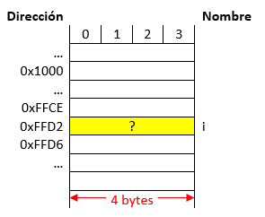
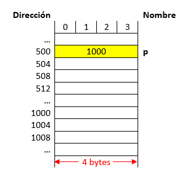
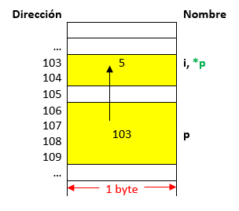
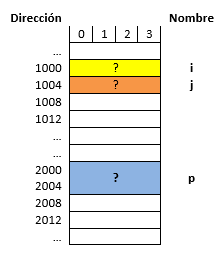
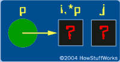
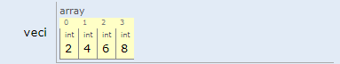
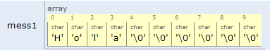

---
jupytext:
  cell_metadata_filter: -all
  formats: md:myst
  text_representation:
    extension: .md
    format_name: myst
    format_version: 0.13
    jupytext_version: 1.11.5
kernelspec:
  display_name: Python 3
  language: python
  name: python3
---

# Apuntadores y arreglos

```{admonition} Objetivos
* Conocer y utilizar los apuntadores para el uso eficiente de la memoria.
* Presentar el uso de las funciones y establecer cómo se realiza el paso de parámetros a funciones.
* Conocer y aplicar el concepto de arreglos de una y más dimensiones en la resolución de problemas mediante algoritmos.
* Conocer cómo es posible asignar de forma eficiente espacio en memoria.
```

## 1. Conceptos previos - ¿Que sucede cuando se declara una variable?

Cuando una variable se declara esta pasa a ocupar un lugar de memoria cuyo tamaño dependerá del número de bytes asociados al tipo de dato con el cual esta se declara. Suponiendo que se tienen las siguientes instrucciones en C:

```{code-block} c
int i;
i = 35;
```

La siguiente figura ilustra su representación en memoria:

```{figure} ./local/img/CH_02-S02-fig1.png
Representación de una variable en memoria.
```

Desde el punto de vista del mapa de memoria y suponiendo que una variable tipo int ocupa 4 bytes tenemos el siguiente resultado por instrucción:

|Instrucción|Representación en memoria|
|----|----|
|`int i;`||
|`i = 35;`||


Como se puede ver en la figura anterior, lo que se modifica cuando se hace manipulación sobre variables es el contenido almacenado en un lugar especifico de memoria. Entender esto es de vital importancia para manejar el próximo tema.

## 2. Entrando en materia - Algunos aspectos sobre los apuntadores

### 2.1. ¿Que es un apuntador?

Un apuntador es una variable que almacena una **dirección de memoria y no un valor** como ocurre en el caso de las variables normales. La siguiente tabla resalta este hecho:

|Instrucciones|Mapa de memoria|
|----|----|
|`int *p;`<br>`p = 1000;`<br><br>**Nota**: Supóngase que el apuntador `p` se encuentra en la posición 500||
|`int *p;`<br>`p = 1000;`<br><br>**Nota**: Supóngase que la variable `p` se encuentra en la posición 500  ||


Como se puede notar en la figura anterior, cuando el valor almacenado en el apuntador hará referencia a la dirección 1000 y no al valor de 1000, esto nos permitirá acceder a dicho lugar de memoria desde el apuntador. Más tarde veremos cómo. Así mismo, como un apuntador guarda una dirección de memoria y teniendo en cuenta que para el ejemplo se supone una arquitectura en la cual se manejan 32 bits ( equivalentes a 4 bytes), esto hará que una variable tipo apuntador sin importar el tipo de dato al que apunte tenga un tamaño de 4 bytes. (Este tamaño se define por la arquitectura. Por ejemplo si la maquina es de 64 bits entonces el tamaño ocupado por una variable tipo apuntador será de 8 bytes).

### 2.2. ¿Como se declara un apuntador?

Un apuntador se declara de la siguiente manera (donde las cosas que se encuentran entre corchetes son opcionales):

```{code-block} c
tipo *[modificadores_del_tipo] nombre [=valor inicial];
```

Dónde:
* **Tipo**: Tipo de dato al cual se desea apuntar, puede ser un tipo de dato simple (`char`, `int`, etc.) o un tipo de dato complejo como una estructura).
* **Modificadores del tipo**: Puede contener cualquier combinación de los modificadores de tipo `const`, `volatile` y `restrict`.
* **Nombre**: Nombre del apuntador.
* **Valor inicial**: Valor inicial del apuntador. 

La siguiente figura muestra esto lo anterior en términos del mapa de memoria:

|Instrucciones|Mapa de memoria|
|----|----|
|`short i = 5;` <br> `short *ptr = &i;`<br> <br> **Nota**: <ul> <li>El tamaño de una variables short es de 2 bytes.</li> <li>El tamaño de una variable tipo apuntador es de 4 bytes.</li> <li>En el dibujo del mapa de memoria cada dirección aumenta de 1 en 1</li> </ul> ||

Como se puede notar en la figura anterior, lo que se guarda en el apuntador es la dirección base (dirección del byte de menor peso) de la variable a la cual se apunta. Para el caso anterior, la variable `i` ocupa 2 bytes (`103` y `104`) sin embargo, en el apuntador se almacena la parte menos correspondiente al byte pesado (byte `103`). 

Si observa la segunda instrucción anteriormente mostrada, la forma como se obtuvo la dirección de `i` fue por medio del operador dirección (`&`) antepuesto a la variable. La siguiente tabla se llena con base en la figura anterior:


| Expresión	| Significado |	Valor |
|-----------|-------------|-------|
|`i`	| Contenido de `i`	|`5`|
|`&i`	| Dirección de `i`	|`103`|
|`p`	| Contenido del apuntador `p`	|`103`|
|`&p`	| Dirección del apuntador `p`	|`106`|

Note en la tabla anterior y la figura previa que con & lo que se obtiene es dirección base de una variable no importa su tipo ya sea una variable normal (`char`, `int`, `float`, etc), apuntador u otro. A continuación se muestra una forma simplificada (tomada de la sección **Pointers basics** de [How Stuff Works](https://computer.howstuffworks.com/c22.htm)) para visualizar los apuntadores y las variables comunes de manera gráfica sin tener que recurrir al bosquejo del mapa de memoria previamente realizado. 


```{figure} ./local/img/CH_02-S02-fig7.png
---
name: mem_ptr
---
Vista simplificada con variables y apuntadores.
```

Note la diferencia en la gráfica, en el dibujo el circulo representa una variable tipo apuntador y como tal almacena una dirección de memoria, la de `i` para el caso (103); por otro lado el vinculo entre el apuntador y la variable se representa por medio de la flecha. Finalmente, el contenido de la variable puede ser accedido o manipulado desde el símbolo `i`, o desde al desreferenciar el apuntador (usando `*ptr`), pero este sera un tema a tratar después.

Una forma aun mas simplificada e incluso mas conveniente al momento de hacer pruebas de escritorio se muestra a continuación. En esta solo se resalta el vinculo del apuntador con la variable:

```{figure} ./local/img/CH_02-S02-fig8.png
---
name: mem_ptr
---
Vista aun mas simplificada con variables y apuntadores.
```

### 2.3. Manipulación de memoria mediante apuntadores

Una de las aplicaciones más importantes es el acceso directo a memoria para su manipulación. Para ello, se manejan dos operadores importantes los cuales el operador referencia (&) y el operador des-referencia (*).

#### 2.3.1. Referenciar un apuntador

Consiste en asociar el apuntador a una dirección específica (durante la declaración o después de esta), para esto se suele usar el operador & para obtener la dirección de la variable en cuestión. A continuación se muestra la forma como normalmente se hace esto:

```{code-block} c
apuntador = &variable;
```

También es posible referenciar un apuntador pasándole el valor que se tiene en otro apuntador. Note que no se hizo uso del operador & en este caso:

```{code-block} c
apuntador = &variable;
```

Todo apuntador debe inicializarse antes de usarse. Si esto no se hace, cuando intente usarlo para hacer alguna operación en memoria el programa sacara un error. Un puntero que no ha sido inicializado se conoce como **Wild pointer**.

#### 2.3.2. Des-referenciar un apuntador
Para poder acceder al lugar de memoria que está siendo apuntado por el puntero y realizar operaciones de lectura y escritura sobre esta dirección de memoria se debe des-referenciar el apuntador. Para ello se hace uso del operador des-referencia (*) después de la declaración del apuntador. El contenido del lugar de memoria apuntado (lectura) se obtiene de la siguiente manera:

```{code-block} c
variable = *apuntador;
```

Ahora si lo que se desea hacer es escribir en el lugar de memoria apuntado se hace lo siguiente:

```{code-block} c
*apuntador = variable;
```

#### 2.3.3. Ejemplos

1. Suponga que se tiene el siguiente fragmento de código fuente:
   
   ```{code-block} c
   #include <stdio.h>

   int main() {
     int i,j;
     int *p; //Apuntador a un entero
     p = &i;
     *p = 5;
     return 0;
   }
   ```

   También tenga en cuenta lo siguientes enunciados:
   * Suponga que `i` y `j` son de `4` bytes y ocupan las direcciones base `1000` y `1004`.
   * El apuntador `p` ocupa las direccione base `2000`.
   * Así mismo la arquitectura es de `64` bits por lo que el espacio ocupado por el apuntador sera de `8` bytes.

   Muestre la ejecución paso a paso del código anterior resaltando la evolución en memoria.

   **Solución**: Las instrucciones que se están evaluando en un momento dado se resaltan en la siguiente tabla:

   |Instrucciones ejecutadas|Contenido del mapa de memoria|Visualización al estilo HowStuffWorks|
   |---|---|---|
   |`int i,j;` <br> `int *p; //Apuntador a un entero` <br> `p = &i;` <br> `*p = 5;`	|||
   |`int i,j;` <br> `int *p; //Apuntador a un entero` <br>  `p = &i;` <br> `*p = 5;`|||
   |`int i,j;` `int *p; //Apuntador a un entero` <br> `p = &i;` <br> `*p = 5;`|||

   Note que en la última instrucción resaltada el cambio del contenido de la sección de memoria asociado a la variable `i` no se realizó desde esta (`i = 5`) sino desde el apuntador `p` (`*p = 5`) el cual previamente se puso a apuntar a dicho lugar de memoria (`p = &i`).


   La simulación del código anterior se muestra a continuación:

   <iframe width="800" height="500" frameborder="0" src="https://pythontutor.com/iframe-embed.html#code=%23include%20%3Cstdio.h%3E%0A%0Aint%20main%28%29%20%7B%0A%20%20int%20i,j%3B%0A%20%20int%20*p%3B%20//Apuntador%20a%20un%20entero%0A%20%20p%20%3D%20%26i%3B%0A%20%20*p%20%3D%205%3B%0A%20%20return%200%3B%0A%7D&codeDivHeight=400&codeDivWidth=350&cumulative=false&curInstr=0&heapPrimitives=nevernest&origin=opt-frontend.js&py=c_gcc9.3.0&rawInputLstJSON=%5B%5D&textReferences=false"> </iframe>


2. A continuación se muestra otro ejemplo en el cual se resalta que es posible que varios apuntadores estén apuntando a un mismo lugar de memoria. Tenga en cuenta lo siguientes enunciados:
   * Suponga que `i` y `j` son de `4` bytes y ocupan las direcciones base `1000` y `1008`.
   * Los apuntadores `p`, `q` y `r` ocupan las direcciones base `2000`, `3000` y `4000`.
   * Así mismo la arquitectura es de `32` bits por lo que el espacio ocupado por el apuntador será de `4` bytes.
   
   El codigo asociado se muestra a continuación:

   ```{code-block} c
   #include <stdio.h>

   int main() {
     int i;
     int *p,*q,*r;
     p = &i;
     q = &i;
     r = p; 
     return 0;
   }
   ```

   **Solución**: la siguiente tabla muestra con detalle los resultados:

   |Instrucciones ejecutadas|	Contenido del mapa de memoria	| Visualización al estilo HowStuffWorks|
   |---|---|---|
   |`int i = 5;` <br> `int *p,*q,*r;` <br> `p = &i;` <br> `q = &i;` <br> `r = p;`|||||

   La simulación del código anterior se muestra a continuación:

   <iframe width="800" height="500" frameborder="0" src="https://pythontutor.com/iframe-embed.html#code=%23include%20%3Cstdio.h%3E%0A%0Aint%20main%28%29%20%7B%0A%20%20int%20i%3B%0A%20%20int%20*p,*q,*r%3B%0A%20%20p%20%3D%20%26i%3B%0A%20%20q%20%3D%20%26i%3B%0A%20%20r%20%3D%20p%3B%20%0A%20%20return%200%3B%0A%7D&codeDivHeight=400&codeDivWidth=350&cumulative=false&curInstr=0&heapPrimitives=nevernest&origin=opt-frontend.js&py=c_gcc9.3.0&rawInputLstJSON=%5B%5D&textReferences=false"> </iframe>


### 2.4. Usos de los apuntadores

#### 2.4.1. Funciones y apuntadores

Como se vio en la primera parte del laboratorio, existen dos maneras de hacer llamados a funciones, por referencia y por valor. Cuando se realiza un **llamado por valor**; se trabaja sobre una copia de la variable pasada como argumento y por lo tanto la variable original (la que se pasó como argumento) no se modifica. Por otro lado, cuando se realiza un **llamado por referencia** al estar accediendo al lugar de memoria en el que se encuentra la variable pasada como argumento es posible modificar el valor original de la variable pasada como argumento. La siguiente tabla compara un poco la diferencia entre referencia y valor:


|Ítem analizado	| Llamada por valor |	Llamada por referencia|
|---|---|---|
|**Declaración**|	`void swap(int i, int j);` |	`void swap(int *i, int *j);`|
|**Definición**|	`void swap(int i, int j) {` <br>  `  int t;` <br>  `  t = i;` <br>  `  i = j;`  <br>  `  j = t;` <br> `}` |	`int v1 = 1, v2 = 2;` <br> `swap(v1, v2);` |
|**Invocación**|	`void swap(int *i, *int j) {` <br> `  int t;` <br> `  t = *i;` <br> `  *i = *j;` <br> `  *j = t;` <br> `}` |	`int v1 = 1, v2 = 2;` <br>`swap(&v1, &v2);`|


El paso de funciones por referencia es de extrema utilidad cuando los argumentos que se están pasando a la función son pesados ya que esto evita que se tengan que hacer copias de dichos argumentos que en el peor de los casos pueden ocasionar que el programa colapse por llenar **stack**. También, mediante el uso de apuntadores, es posible superar la restricción que se tiene en la cual una función no puede retornar más de un elemento; así, por medio de referencias es posible retornar un array por ejemplo.

Para indicar que una función será pasada por referencia, se emplean apuntadores en la cabecera de la función, esto porque lo que se pasa como argumento es la dirección de memoria. Por ejemplo:


```{code-block} c 
tipo_retorno f(tipo_1 *pName_1,tipo_2 *pName_2,...,tipo_N *pName_N)
```

Para aterrizar un poco más lo anterior, supongamos esta función:

```{code-block} c
void swap(int *i, int *j) {
    int t;
    t = *i;
    *i = *j;
    *j = t;
}
```

Como se pueden notar en la definición de la función anterior, en este caso ambos argumentos son pasados por referencia. 

Ahora en lo que respecta a la invocación si lo que se pasa es como parámetro es una variable como tal se debe hacer uso del operador **`&`** para obtener la dirección de dicha variable y así inicializar el apuntador que funciona como argumento. Por otro lado si lo que se está pasando es un apuntador a una variable, no es necesario usar el operador **`&`** ya que el valor almacenado en este será una dirección de memoria. La siguiente tabla ilustra esto:

|Caso | Invocación | Observaciones|
|----|----|----|
|Se está pasando una variable a una función que se llama por referencia	|`int a = 5, b = 10;` <br> `swap(&a,&b);`	|Es necesario usar el operador `&` para obtener la dirección de memoria de las variables y así poder inicializar lo apuntadores que funcionan como argumentos.|
|Se está pasando apuntador a una función que se llama por referencia	|`int a = 5, b = 10;` <br> `int *px = &a, *py;` <br> `py = &b;` <br> `swap(px,py);` |	Como lo que se pasan son apuntadores previamente inicializados, estos ya tienen la dirección de memoria de la variable que será pasada como argumento de la función, por lo tanto no es necesario usar el operador `&`.|

La siguiente figura (tomada de [HowStuffWorks](http://computer.howstuffworks.com/c26.htm)) muestra cómo trabaja una función por referencia:

```{figure} ./local/img/CH_02-S02-fig13.png
---
name: call_reff
---
Llamado por referencia.
```

Para aclarar un poco observe el siguiente código:

```{code-block} c
#include <stdio.h>

void swap_ref(int *x, int *y);
void swap_val(int x, int y);

int main() {
    int x = 5, y = 10;
    printf("---------------------------------------------------\n");
    printf("Llamada por valor \n");
    printf("Antes del swap -> x = %d, y = %d\n",x,y);
    swap_val(x, y);
    printf("Después del swap -> x = %d, y = %d\n",x,y);
    printf("---------------------------------------------------\n");
    printf("Llamada por referencia \n");
    printf("Antes del swap -> x = %d, y = %d\n",x,y);
    swap_ref(&x, &y);
    printf("Después del swap -> x = %d, y = %d\n",x,y);
    printf("---------------------------------------------------\n");
    return 0;
}

void swap_val(int x, int y) {    
  int t;    
  t = x;    
  x = y;    
  y = t; 
}

void swap_ref(int *x, int *y) {
  int temp;
  temp = *x;
  *x = *y;
  *y = temp;    
}
```

La simulación del código anterior se puede observar a continuación:

<iframe width="800" height="500" frameborder="0" src="https://pythontutor.com/iframe-embed.html#code=%23include%20%3Cstdio.h%3E%0A%0Avoid%20swap_ref%28int%20*x,%20int%20*y%29%3B%0Avoid%20swap_val%28int%20x,%20int%20y%29%3B%0A%0Aint%20main%28%29%20%7B%0A%20%20%20%20int%20x%20%3D%205,%20y%20%3D%2010%3B%0A%20%20%20%20printf%28%22---------------------------------------------------%5Cn%22%29%3B%0A%20%20%20%20printf%28%22Llamada%20por%20valor%20%5Cn%22%29%3B%0A%20%20%20%20printf%28%22Antes%20del%20swap%20-%3E%20x%20%3D%20%25d,%20y%20%3D%20%25d%5Cn%22,x,y%29%3B%0A%20%20%20%20swap_val%28x,%20y%29%3B%0A%20%20%20%20printf%28%22Despu%C3%A9s%20del%20swap%20-%3E%20x%20%3D%20%25d,%20y%20%3D%20%25d%5Cn%22,x,y%29%3B%0A%20%20%20%20printf%28%22---------------------------------------------------%5Cn%22%29%3B%0A%20%20%20%20printf%28%22Llamada%20por%20referencia%20%5Cn%22%29%3B%0A%20%20%20%20printf%28%22Antes%20del%20swap%20-%3E%20x%20%3D%20%25d,%20y%20%3D%20%25d%5Cn%22,x,y%29%3B%0A%20%20%20%20swap_ref%28%26x,%20%26y%29%3B%0A%20%20%20%20printf%28%22Despu%C3%A9s%20del%20swap%20-%3E%20x%20%3D%20%25d,%20y%20%3D%20%25d%5Cn%22,x,y%29%3B%0A%20%20%20%20printf%28%22---------------------------------------------------%5Cn%22%29%3B%0A%20%20%20%20return%200%3B%0A%7D%0A%0Avoid%20swap_val%28int%20x,%20int%20y%29%20%7B%20%20%20%20%0A%20%20int%20t%3B%20%20%20%20%0A%20%20t%20%3D%20x%3B%20%20%20%20%0A%20%20x%20%3D%20y%3B%20%20%20%20%0A%20%20y%20%3D%20t%3B%20%0A%7D%0A%0Avoid%20swap_ref%28int%20*x,%20int%20*y%29%20%7B%0A%20%20int%20temp%3B%0A%20%20temp%20%3D%20*x%3B%0A%20%20*x%20%3D%20*y%3B%0A%20%20*y%20%3D%20temp%3B%20%20%20%20%0A%7D&codeDivHeight=400&codeDivWidth=350&cumulative=false&curInstr=0&heapPrimitives=nevernest&origin=opt-frontend.js&py=c_gcc9.3.0&rawInputLstJSON=%5B%5D&textReferences=false"> </iframe>

La salida del código anterior se muestra a continuación.

```
---------------------------------------------------
Llamada por valor 
Antes del swap -> x = 5, y = 10
Después del swap -> x = 5, y = 10
---------------------------------------------------
Llamada por referencia 
Antes del swap -> x = 5, y = 10
Después del swap -> x = 10, y = 5
---------------------------------------------------
```

Una función también puede retornar un apuntador cuando es invocada, para hacer esto, en la definición y declaración de la función se debe indicar que la función retornara un apuntador lo cual se hace precediendo el nombre de la función por un asterisco (Ver parte resaltada e rojo a continuación en la *fig 5*). A continuación se muestra la forma que debe llevar la función para este caso:

```{code-block} c
tipo_retorno *f(parámetros...) 
```

Observe el siguiente fragmento de código, el cual consiste en una función que obtiene el valor mayor de un vector mediante apuntadores devolviendo la dirección del elemento mayor mediante un apuntador:

```{code-block} c
int *mayor(int *a, int n) {
  int i;
  int *m = a;
  a++;
  for (i = 1; i < n; ++i )
    if(*m < *a) {
      m = a;
      a++;
    }
  return m;
}
```

La declaración de la función anterior se muestra a continuación:

```{code-block} c
int *mayor(int *a, int n); 
```

Otra forma de declaración puede ser:

```{code-block} c
int *mayor(int *, int n); 
```

Recuerde lo importante en la declaración de la función es indicarle al compilador como van a usarse los parámetros.

Así mismo, note también, que lo realimente importante es que se declaró un apuntador a un tipo de dato específico, se inicializo, se actualizo y luego se retornó este, en general en la definición de la función se sigue la siguiente plantilla:

```C
tipo *funcion(tipo *arg1,...) {
  tipo *ptr;  // Declaración del apuntador
  ptr = &arg; // Inicialización del apuntador
  
  /** Operaciones **/
  ...  
  return ptr; // Retorno del apuntador
}
```

El código descrito por partes anteriormente, se muestra completo a continuación:

```{code-block} c
#include <stdio.h>

int *mayor(int *a,int n); // Declaracion

int main() {
    int a[6] = {1,2,5,9,-1,3};
    int *p;
    p = mayor(a,5); // Invocación
    printf("El elemento mayor del vector es: %d\n",*p);
    return 0;
}

// Definición
int *mayor(int *a,int n) {
  int i;
  int *m = a;
  a++;
  for (i = 1; i < n; ++i )
    if(*m < *a) {
      m = a;
      a++;
    }
  return m;
}
```

A continuación se puede simular el código anterior:


<iframe width="800" height="500" frameborder="0" src="https://pythontutor.com/iframe-embed.html#code=%23include%20%3Cstdio.h%3E%0A%0Aint%20*mayor%28int%20*a,int%20n%29%3B%20//%20Declaracion%0A%0Aint%20main%28%29%20%7B%0A%20%20%20%20int%20a%5B6%5D%20%3D%20%7B1,2,5,9,-1,3%7D%3B%0A%20%20%20%20int%20*p%3B%0A%20%20%20%20p%20%3D%20mayor%28a,5%29%3B%20//%20Invocaci%C3%B3n%0A%20%20%20%20printf%28%22El%20elemento%20mayor%20del%20vector%20es%3A%20%25d%5Cn%22,*p%29%3B%0A%20%20%20%20return%200%3B%0A%7D%0A%0A//%20Definici%C3%B3n%0Aint%20*mayor%28int%20*a,int%20n%29%20%7B%0A%20%20int%20i%3B%0A%20%20int%20*m%20%3D%20a%3B%0A%20%20a%2B%2B%3B%0A%20%20for%20%28i%20%3D%201%3B%20i%20%3C%20n%3B%20%2B%2Bi%20%29%0A%20%20%20%20if%28*m%20%3C%20*a%29%20%7B%0A%20%20%20%20%20%20m%20%3D%20a%3B%0A%20%20%20%20%20%20a%2B%2B%3B%0A%20%20%20%20%7D%0A%20%20return%20m%3B%0A%7D&codeDivHeight=400&codeDivWidth=350&cumulative=false&curInstr=0&heapPrimitives=nevernest&origin=opt-frontend.js&py=c_gcc9.3.0&rawInputLstJSON=%5B%5D&textReferences=false"> </iframe>


La siguiente figura muestra el estado de ejecución del programa antes de hacer el retorno de la subrutina mayor:


```{figure} ./local/img/CH_02-S02-fig14.png
---
name: ret_ptr
---
Llamado por referencia.
```

La salida del programa anterior en pantalla es la siguiente:

```
El elemento mayor del vector es: 9
```

### 2.4.2. Apuntadores y vectores

#### 2.4.2.1. Vectores

Un arreglo es un conjunto o colección indexada que permite manejar elementos que son del mismo tipo de dato como un solo objeto. El siguiente fragmento de codigo muestra la declaración de varios arreglos:

```{code-block} c
#include <stdio.h>

int main() {
  int veci[4] = {2, 4, 6, 8};
  float vecf[] = {2.657, 7.9, 2.003, 1.1, 5.8, 8.54, 9.5, 4.09}; 
  char mess1[10] = "Hola";
  char mess2[] = {'H','o','l','a','\0'};
  return 0;
}
```

A continuación se muestra la simulación del codigo anterior:

<iframe width="800" height="500" frameborder="0" src="https://pythontutor.com/iframe-embed.html#code=%23include%20%3Cstdio.h%3E%0A%0Aint%20main%28%29%20%7B%0A%20%20int%20veci%5B4%5D%20%3D%20%7B2,%204,%206,%208%7D%3B%0A%20%20float%20vecf%5B%5D%20%3D%20%7B2.657,%207.9,%202.003,%201.1,%205.8,%208.54,%209.5,%204.09%7D%3B%20%0A%20%20char%20mess1%5B10%5D%20%3D%20%22Hola%22%3B%0A%20%20char%20mess2%5B%5D%20%3D%20%7B'H','o','l','a','%5C0'%7D%3B%0A%20%20return%200%3B%0A%7D&codeDivHeight=400&codeDivWidth=350&cumulative=false&curInstr=0&heapPrimitives=nevernest&origin=opt-frontend.js&py=cpp_g%2B%2B9.3.0&rawInputLstJSON=%5B%5D&textReferences=false"> </iframe>

La siguiente tabla resume los resultados en memoria del codigo anterior:

|Declaración del arreglo|Representación en memoria|
|----|----|
|`int veci[4] = {2, 4, 6, 8};`||
|`float vecf[] = {2.657, 7.9, 2.003, 1.1, 5.8, 8.54, 9.5, 4.09}; `||
|`char mess1[10] = "Hola";`||
|`char mess2[] = {'H','o','l','a','\0'};`||

Notese, que cuando no se pasa el **tamaño** en la declaracion entre corchetes; este es deducido de la lista de inicializacion (pasada entre llaves) o la cadena de caracteres (string) pasada al declarar. En sí, se sigue la siguiente forma:
* **Forma 1**: Pasando el tamaño:

  ```C
  tipo arrayName[TAM] = {valor1, valor2, ...};
  ```

  **Nota**: La cantidad de elementos de la lista de inicialización no puede superar el tamaño (TAM) del arreglo. 

* **Forma 2**: Pasando el tamaño:

  ```C
  tipo arrayName[] = {valor1, valor2, ...};
  ```

Por otro lado, cuando solo se declaran los arreglos pero no se inicializan, es obligatorio colocar entre corchetes el **tamaño**. La forma de hacer esto se muestra a continuación:

```C
tipo arrayName[TAM];
```

El siguiente codigo muestra el caso en el que solo se declaran varios vectores de diferentes tipos tanto globales como locales:

```{code-block} c
#include <stdio.h>

// Variables globales
int A[3];
double B[4];

int main() {
  // Variables locales
  char C[6];
  int D[2];
  return 0;
}
```

La simulación del código se muestra a continuación:

<iframe width="800" height="500" frameborder="0" src="https://pythontutor.com/iframe-embed.html#code=%23include%20%3Cstdio.h%3E%0A%0A//%20Variables%20globales%0Aint%20A%5B3%5D%3B%0Adouble%20B%5B4%5D%3B%0A%0Aint%20main%28%29%20%7B%0A%20%20//%20Variables%20locales%0A%20%20char%20C%5B6%5D%3B%0A%20%20int%20D%5B2%5D%3B%0A%20%20return%200%3B%0A%7D&codeDivHeight=400&codeDivWidth=350&cumulative=false&curInstr=0&heapPrimitives=nevernest&origin=opt-frontend.js&py=c_gcc9.3.0&rawInputLstJSON=%5B%5D&textReferences=false"> </iframe>

Observe la diferencia en el valor inicial de los arreglos globales respecto a los locales:

```{figure} ./local/img/CH_02-S02-fig16.png
---
name: array_no_init
---
Representación en memoria de arreglos no inicializados.
```

#### 2.4.2.2. Manipulación de arreglos

En lo que respecta a la manipulacion de arreglos, es igual que en java. El uso de estructuras repetitivas para el manejo de los subindices en el arreglo es empleado. En los siguientes ejemplos se tiene ilustra esto de manera rapida.

**Ejemplos**

1. Hacer un progama que llene un arreglo de `10` elementos con los multiplos del `10` (`1`, `10`, `20`, etc.).
   
   **Solución**: El código que soluciona el problema se muestra a continuación:
   
   ```{code-block} c
   #include <stdio.h>

   #define TAM 10

   int main() {
     int A[TAM];
     int num = 1;
     // Inicializando el arreglo
     for(int i = 0; i < TAM; i++) {
       A[i] = 10*num;
       num++;     
     }
     // Imprimiendo el arreglo
     printf("A = [ ");
     for(int i = 0; i < TAM; i++) {
       printf("%d ", A[i]);     
     }
     printf("]\n");
     return 0;
   }
   ```
   
   La simulación del código anterior se muestra a continuación:

   <iframe width="800" height="500" frameborder="0" src="https://pythontutor.com/iframe-embed.html#code=%23include%20%3Cstdio.h%3E%0A%0A%23define%20TAM%2010%0A%0Aint%20main%28%29%20%7B%0A%20%20int%20A%5BTAM%5D%3B%0A%20%20int%20num%20%3D%201%3B%0A%20%20//%20Inicializando%20el%20arreglo%0A%20%20for%28int%20i%20%3D%200%3B%20i%20%3C%20TAM%3B%20i%2B%2B%29%20%7B%0A%20%20%20%20A%5Bi%5D%20%3D%2010*num%3B%0A%20%20%20%20num%2B%2B%3B%20%20%20%20%20%0A%20%20%7D%0A%20%20//%20Imprimiendo%20el%20arreglo%0A%20%20printf%28%22A%20%3D%20%5B%20%22%29%3B%0A%20%20for%28int%20i%20%3D%200%3B%20i%20%3C%20TAM%3B%20i%2B%2B%29%20%7B%0A%20%20%20%20printf%28%22%25d%20%22,%20A%5Bi%5D%29%3B%20%20%20%20%20%0A%20%20%7D%0A%20%20printf%28%22%5D%5Cn%22%29%3B%0A%20%20return%200%3B%0A%7D&codeDivHeight=400&codeDivWidth=350&cumulative=false&curInstr=0&heapPrimitives=nevernest&origin=opt-frontend.js&py=c_gcc9.3.0&rawInputLstJSON=%5B%5D&textReferences=false"> </iframe>

   La aplicacion arroja el siguiente resultado:

   ```{figure} ./local/img/CH_02-S02-fig17.png
   ---
   name: array_ciclos1
   ---
   Empleo de ciclos para manipulación de arrays.
   ```

2. Hacer cree dos arreglos (`A` y `B`), luego, inicialice el arreglo `A` con numeros aleatorios entre el `1` y el `20`, y finalmente lleve al arreglo `B` los elementos del arreglo `A` en orden inverso.

   **Solución**: A continuación, se muestra el código solución:
   
   ```{code-block} c
   #include <stdio.h>
   #include <stdlib.h> // required to use 'rand()'
   #include <time.h>  // required to use 'srand(time(NULL))'
   
   #define TAM 10

   int main() {
     srand(time(NULL)); // required for "randomness"
     int A[TAM], B[TAM];
     int limSup = 20, limInf = 1;  
     // Inicializando el arreglo
     for(int i = 0; i < TAM; i++) {
       A[i] = rand()%limSup + limInf; // generate a number 
                                      // between limInf and limSup
     
     }
     // Imprimiendo el arreglo A
     printf("A = [ ");
     for(int i = 0; i < TAM; i++) {
       printf("%d ", A[i]);   
       B[TAM - (i + 1)] = A[i];
     }
     printf("]\n"); 
     // Imprimiendo el arreglo B
     printf("B = [ ");
     for(int i = 0; i < TAM; i++) {
       printf("%d ", B[i]);   
     }
     printf("]\n");
     return 0;  
   }
   ```

   La simulación se muestra a continuación:

   <iframe width="800" height="500" frameborder="0" src="https://pythontutor.com/iframe-embed.html#code=%23include%20%3Cstdio.h%3E%0A%23include%20%3Cstdlib.h%3E%20//%20required%20to%20use%20'rand%28%29'%0A%23include%20%3Ctime.h%3E%20%20//%20required%20to%20use%20'srand%28time%28NULL%29%29'%0A%0A%23define%20TAM%2010%0A%0Aint%20main%28%29%20%7B%0A%20%20srand%28time%28NULL%29%29%3B%20//%20required%20for%20%22randomness%22%0A%20%20int%20A%5BTAM%5D,%20B%5BTAM%5D%3B%0A%20%20int%20limSup%20%3D%2020,%20limInf%20%3D%201%3B%20%20%0A%20%20//%20Inicializando%20el%20arreglo%0A%20%20for%28int%20i%20%3D%200%3B%20i%20%3C%20TAM%3B%20i%2B%2B%29%20%7B%0A%20%20%20%20A%5Bi%5D%20%3D%20rand%28%29%25limSup%20%2B%20limInf%3B%20//%20generate%20a%20number%20%0A%20%20%20%20%20%20%20%20%20%20%20%20%20%20%20%20%20%20%20%20%20%20%20%20%20%20%20%20%20%20%20%20%20%20%20//%20between%20limInf%20and%20limSup%0A%20%20%20%20%20%0A%20%20%7D%0A%20%20//%20Imprimiendo%20el%20arreglo%20A%0A%20%20printf%28%22A%20%3D%20%5B%20%22%29%3B%0A%20%20for%28int%20i%20%3D%200%3B%20i%20%3C%20TAM%3B%20i%2B%2B%29%20%7B%0A%20%20%20%20printf%28%22%25d%20%22,%20A%5Bi%5D%29%3B%20%20%20%0A%20%20%20%20B%5BTAM%20-%20%28i%20%2B%201%29%5D%20%3D%20A%5Bi%5D%3B%0A%20%20%7D%0A%20%20printf%28%22%5D%5Cn%22%29%3B%20%0A%20%20//%20Imprimiendo%20el%20arreglo%20B%0A%20%20printf%28%22B%20%3D%20%5B%20%22%29%3B%0A%20%20for%28int%20i%20%3D%200%3B%20i%20%3C%20TAM%3B%20i%2B%2B%29%20%7B%0A%20%20%20%20printf%28%22%25d%20%22,%20B%5Bi%5D%29%3B%20%20%20%0A%20%20%7D%0A%20%20printf%28%22%5D%5Cn%22%29%3B%0A%20%20return%200%3B%20%20%0A%7D&codeDivHeight=400&codeDivWidth=350&cumulative=false&curInstr=0&heapPrimitives=nevernest&origin=opt-frontend.js&py=c_gcc9.3.0&rawInputLstJSON=%5B%5D&textReferences=false"> </iframe>

   El resultado de la simulación se muestra a continuación:

   ```{figure} ./local/img/CH_02-S02-fig18.png
   ---
   name: array_ciclos2
   ---
   Otro ejemplo de empleo de ciclos para manipulación de arrays.
   ```

#### 2.4.2.3. Arreglos y funciones

Es posible pasar **arreglos** como argumentos de funciones. Basicamente para el caso se tienen en cuenta los mismos 3 aspectos que se mencionaron previamente al tratar las funciones de manera introductoria, pero hay una leve diferencia cuando se emplean arreglos y es propiamente en la parte de la declaracion y la definicion donde se nota esto. Veamos la forma:

**Definición de la función**

```{code-block} c
return_type function_name (data type array[],...) {
  local declarations;
  function statements;
}
```

**Declaración de la función**

```{code-block} c
return_type function_name (data type arrayParam[],...) 
```

**Invocación de la función**

```{code-block} c
[return_type var = ] function_name (arrayArg[],...) 
```

**Ejemplo**

1. Observe el ejemplo 2 anteriormente analizado, muestra cada uno de los componentes (definición, declaracón e invocación) de lo que sería una función para imprimir entero un vector de cualquier tamaño.
   
   * **Definición de la función**:
     
     ```{code-block} c
     // Definicion de la funcion para imprimir un array de cualquier tamaño
     void imprimirVector(int V[],int tam) {
       printf("[ ");
       for(int i = 0; i < tam; i++) {
         printf("%d ", V[i]);   
       }
       printf("]\n");
     }
     ```

   * **Declaración de la función**:
  
     ```{code-block} c
     // Declaracion de la funcion para imprimir un array de cualquier tamaño
     void imprimirVector(int V[],int tam);
     ```

   * **Invocación de la función**:

     ```{code-block} c
     // Invocacion para imprimir 
     int X[] = {1, 2, 3, 4};
     imprimirVector(X, 4); // Salida --> [ 1 2 3 4 ]
     ```

2. Observe el ejemplo 1 anteriormente analizado e implementelo en forma modular empleando funciones.
   
   **Solución**: La implementación del código completo se muestra a continuación:

   ```{code-block} c
   #include <stdio.h>
   #include <stdlib.h> // required to use 'rand()'
   #include <time.h>  // required to use 'srand(time(NULL))'
   #define TAM 10

   void imprimirVector(int V[],int tam);
   void generarVectorAleatorio(int V[], int tam, int vInf, int vSup);
   void copiaReversa(int destino[], int origen[], int tam) ;

   int main() {
     srand(time(NULL)); // required for "randomness"
     int A[TAM], B[TAM];
     int limSup = 20, limInf = 1;  
     generarVectorAleatorio(A, TAM, 1, 20);
     copiaReversa(B, A, TAM);
     // Imprimiendo el arreglo A
     printf("A = ");
     imprimirVector(A, TAM);
     // Imprimiendo el arreglo B
     printf("B = ");
     imprimirVector(B, TAM);
     return 0;  
   }

   void generarVectorAleatorio(int V[], int tam, int vInf, int vSup) {
     for(int i = 0; i < tam; i++) {
       V[i] = rand()%vSup + vInf;            
     }
   }

   void imprimirVector(int V[],int tam) {
     printf("[ ");
     for(int i = 0; i < tam; i++) {
       printf("%d ", V[i]);   
     }
     printf("]\n");
   }

   void copiaReversa(int destino[], int origen[], int tam) {
     for(int i = 0; i < tam; i++) {
       destino[tam - (i + 1)] = origen[i];   
     }
   }
   ```

   El código anterior puede ser simulado a continuación:

   <iframe width="800" height="500" frameborder="0" src="https://pythontutor.com/iframe-embed.html#code=%23include%20%3Cstdio.h%3E%0A%23include%20%3Cstdlib.h%3E%20//%20required%20to%20use%20'rand%28%29'%0A%23include%20%3Ctime.h%3E%20%20//%20required%20to%20use%20'srand%28time%28NULL%29%29'%0A%23define%20TAM%2010%0A%0Avoid%20imprimirVector%28int%20V%5B%5D,int%20tam%29%3B%0Avoid%20generarVectorAleatorio%28int%20V%5B%5D,%20int%20tam,%20int%20vInf,%20int%20vSup%29%3B%0Avoid%20copiaReversa%28int%20destino%5B%5D,%20int%20origen%5B%5D,%20int%20tam%29%20%3B%0A%0Aint%20main%28%29%20%7B%0A%20%20srand%28time%28NULL%29%29%3B%20//%20required%20for%20%22randomness%22%0A%20%20int%20A%5BTAM%5D,%20B%5BTAM%5D%3B%0A%20%20int%20limSup%20%3D%2020,%20limInf%20%3D%201%3B%20%20%0A%20%20generarVectorAleatorio%28A,%20TAM,%201,%2020%29%3B%0A%20%20copiaReversa%28B,%20A,%20TAM%29%3B%0A%20%20//%20Imprimiendo%20el%20arreglo%20A%0A%20%20printf%28%22A%20%3D%20%22%29%3B%0A%20%20imprimirVector%28A,%20TAM%29%3B%0A%20%20//%20Imprimiendo%20el%20arreglo%20B%0A%20%20printf%28%22B%20%3D%20%22%29%3B%0A%20%20imprimirVector%28B,%20TAM%29%3B%0A%20%20return%200%3B%20%20%0A%7D%0A%0Avoid%20generarVectorAleatorio%28int%20V%5B%5D,%20int%20tam,%20int%20vInf,%20int%20vSup%29%20%7B%0A%20%20for%28int%20i%20%3D%200%3B%20i%20%3C%20tam%3B%20i%2B%2B%29%20%7B%0A%20%20%20%20V%5Bi%5D%20%3D%20rand%28%29%25vSup%20%2B%20vInf%3B%20%20%20%20%20%20%20%20%20%20%20%20%0A%20%20%7D%0A%7D%0A%0Avoid%20imprimirVector%28int%20V%5B%5D,int%20tam%29%20%7B%0A%20%20printf%28%22%5B%20%22%29%3B%0A%20%20for%28int%20i%20%3D%200%3B%20i%20%3C%20tam%3B%20i%2B%2B%29%20%7B%0A%20%20%20%20printf%28%22%25d%20%22,%20V%5Bi%5D%29%3B%20%20%20%0A%20%20%7D%0A%20%20printf%28%22%5D%5Cn%22%29%3B%0A%7D%0A%0Avoid%20copiaReversa%28int%20destino%5B%5D,%20int%20origen%5B%5D,%20int%20tam%29%20%7B%0A%20%20for%28int%20i%20%3D%200%3B%20i%20%3C%20tam%3B%20i%2B%2B%29%20%7B%0A%20%20%20%20destino%5Btam%20-%20%28i%20%2B%201%29%5D%20%3D%20origen%5Bi%5D%3B%20%20%20%0A%20%20%7D%0A%7D&codeDivHeight=400&codeDivWidth=350&cumulative=false&curInstr=0&heapPrimitives=nevernest&origin=opt-frontend.js&py=c_gcc9.3.0&rawInputLstJSON=%5B%5D&textReferences=false"> </iframe>

   La siguiente figura muestra el resultado del código anterior:

   ```{figure} ./local/img/CH_02-S02-fig19.png
   ---
   name: funciones_arrays
   ---
   Manipulando arreglos con funciones. 
   ```

#### 2.4.2.4. Apuntadores y vectores

Como los apuntadores son variables es posible realizar operaciones matemáticas sobre ellos, sin embargo debido a que lo almacenado en  estos son direcciones de memoria no todas las operaciones convencionales que se podrían hacer sobre una variable normal son posibles. La siguiente tabla muestra las operaciones validas:


|Operación | Anotaciones|
|----|----|
|Añadir o sustraer un entero de un apuntador.	| Esto hace que el puntero apunte a otro lugar de memoria diferente al que inicialmente estaba apuntando esto debido a la modificación de lo que se encuentra almacenado en este.|
|Sustraer un apuntador de otro.	| Cuando se realiza esta operación, los dos apuntadores deben ser del mismo tipo.|
| Comparar dos apuntadores.	| La comparación es comúnmente empleada para comparar cualquier puntero con el puntero a `NULL` usando los operadores de igualdad (`==` o `!=`).|

Las tres operaciones anteriormente descritas son generalmente útiles para apuntadores que se refieren a los elementos de un array. Recordemos que un array consiste de un conjunto de variables del mismo tipo las cuales pueden ser accedidas bajo un mismo nombre usando subíndices. Cuando se declara un array lo que sucede en memoria es que se reservan un conjunto de posiciones contiguas en memoria tal y como se muestra en la siguiente figura:

```{figure} ./local/img/CH_02-S02-fig20.png
---
name: array_hsw
---
Diferencia entre una variable normal y un vector.
```

Para ilustrar lo anterior suponga lo que tiene dos apuntadores, `p1` y `p2` los cuales están apuntando a los elementos de un array a como el siguiente:

```{figure} ./local/img/CH_02-S02-fig21.png
---
name: array_a
---
Arreglo `a`.
```

* `p1` apunta al elemento `i` del array (`a[i]`).
  
  ```{figure} ./local/img/CH_02-S02-fig22.png
  ---
  name: array_a_p1
  ---
  Arreglo `a` y apuntador `p1`.
  ```


* Si `n` es un entero, entonces la expresión **`p2 = p1 + n`** hace que **`p2`** apunta al elemento **`a[i + n]`**. Ojo que **`i + n`** debe estar dentro del índice del array (es decir **`0 <= i+n <= Tamaño del array - 1`**). La siguiente figura muestra el caso para **`n = 2`**, es decir que **`p2`** apuntara al elemento **`a[i + 2]`**
  
  ```{figure} ./local/img/CH_02-S02-fig23.png
  ---
  name: array_a_p1_p2
  ---
  Arreglo `a` y apuntadores `p1` y `p2`.
  ```

Lo anterior muestra que existe una relación entre la forma de escribir un array con subíndices y escribirlo con apuntadores aritmética de apuntadores. Para aterrizar un poco lo anterior analicemos la siguiente tabla:

|Relación entre índices y array	|En resumen|
|----|----|
|El nombre de un arreglo es realmente un apuntador al primer elemento en el array, así si a es un arreglo unidimensional entonces la dirección del primer elemento del array es `&a[0]` o simplemente `a`.	|`&a[0] ↔ a`|
|La dirección del elemento **`i`** del array puede ser expresada como `&a[i]` o como `a + i`, por lo tanto existen dos manera de escribir la dirección de cualquier elemento del array.|	`&a[i] ↔ a+i`|
|`a[i]` o `*(a + i)` representan el contenido que hay en la dirección en cuestión |	`a[i] ↔ *(a+i)`|

Para entender un poco lo anterior suponga que se ejecutan las siguientes instrucciones:

```{code-block} c
#include <stdio.h>

int main() {
  char b[] = {'h', 'o', 'l', 'a','\0'};
  *(b+2) = *b;
  char *p1 = b;
  char *p2 = b + 3;
  p2 = p2 - 1;
  p1 = p2 - 1;
  *p2 = *(b + 1) + 1;
  p2 = &b[1];
  return 0;
}
```

La simulación del código anterior se muestra a continuación:

<iframe width="800" height="500" frameborder="0" src="https://pythontutor.com/iframe-embed.html#code=%23include%20%3Cstdio.h%3E%0A%0Aint%20main%28%29%20%7B%0A%20%20char%20b%5B%5D%20%3D%20%7B'h',%20'o',%20'l',%20'a','%5C0'%7D%3B%0A%20%20*%28b%2B2%29%20%3D%20*b%3B%0A%20%20char%20*p1%20%3D%20b%3B%0A%20%20char%20*p2%20%3D%20b%20%2B%203%3B%0A%20%20p2%20%3D%20p2%20-%201%3B%0A%20%20p1%20%3D%20p2%20-%201%3B%0A%20%20*p2%20%3D%20*%28b%20%2B%201%29%20%2B%201%3B%0A%20%20p2%20%3D%20%26b%5B1%5D%3B%0A%20%20return%200%3B%0A%7D&codeDivHeight=400&codeDivWidth=350&cumulative=false&curInstr=0&heapPrimitives=nevernest&origin=opt-frontend.js&py=c_gcc9.3.0&rawInputLstJSON=%5B%5D&textReferences=false"> </iframe>

## 3. Aritmetica de punteros

Como se dijo previamente, un apuntador almacena un direccion de memoria asociada a un dato. Tambien, se mostro como es posible hacer uso de apuntadores para barrer y manipular arrays. La existencia diferentes tipos de datos en C (`char`, `int`, `float`, `double`, ...) con un tamaño en bytes asociado repercute en los valores almancenados en el apuntador. Para aclarar esto un poco observemos las siguientes graaficas.

En la figura 10 se muestra un array de datos tipo **`short`** comparado con uno tipo **`char`**. Los datos tipo `short` tienen un tamaño de `2` bytes de modo que cada miembro consecutivo del array tipo `short` (`A`) tendra una direccion aumentada `2` bytes respecto a miembro anterior; segun lo anterior, si la direccion del elemento `A[0]` es `0x1000` (`&A[0] = 0x1000`), la dirección del miembro `A[1]` será `0x1000 + 2bytes = 0x1000 + 16bits = 0x1010`. Por otro lado, en el caso del arreglo char `B`, la direccion solo cambiar de uno en uno. Asi, si `&B[0] = 0x1000`, entonces `&B[1] = 0x1008`. De modo que se puede llegar a una expresión mas general como la siguiente:

```{figure} ./local/img/CH_02-S02-fig24.png
---
name: array_a_p1_p2
---
Arrays y apuntadores.
```

Con: 
  
  `dir[i] = dir[j] +/- n*(sizeof(type)*8) bits`

  Donde `n` es la diferencia entre los indices `j` e `i`

Tomando nuevamente la grafica anterior, vemos que `&A[3] = &A[0] + 3(sizeof(short)8) = 0x1000 + 328 = 0x1000 + 48 = 0x1000 + 0x30 = 0x1030`. De modo similar `B[1] = B[2] - 1(sizeof(char)8)= 0x1000 - 1(18) = 0x1000 + 8 = 0x1000 + 0x0008 = 0x1008`.

A continuación se muestran unos cuantos ejemplos para clarificar lo anteriormente expuesto.

**Ejemplos**

1. Supongase que se tiene el siguiente código:

   ```{code-block} c
   char A[] = {'h', 'o', 'l', 'a','\0'};
   short B[] = {1, 2, 3};
   ``` 

   Asumiendo que un dato tipo `short` ocupa `2 bytes` de memoria y uno `char` ocupa `1 byte`. Dibuje en el mapa de memoria los vectores anteriormente resaltados. Las direcciones base son `100` para el vector `A` y `200` para el vector `B`. Asi mismo, para el caso las direcciones serán manejadas en decimal.

   * **Representacion en memoria con un ancho a 4 bytes**: En la siguiente figura se muestra la representacion en memoria en la cual se manejan `4 bytes` de ancho.
   
     ```{figure} ./local/img/CH_02-S02-fig25.png
     ---
     name: array_hsw
     ---
     Representación a 4 bytes de ancho.
     ```

   * **Representacion en memoria con un ancho a 1 byte**: En la siguiente figura se muestra la representacion en memoria en la cual se manejan `1 byte` de ancho.

     ```{figure} ./local/img/CH_02-S02-fig26.png
     ---
     name: array_hsw2
     ---
     Representación a 1 byte de ancho.
     ```

2. Supongase que se tiene el siguiente codigo fuente:

   ```{code-block} c
   #include <stdio.h>

   int V[4];
   
   int main() {
     printf("%ld\n",sizeof(int));
     printf("%p\n",V);
     int *p1 = V;
     *p1 = 3;
     int *p2 = &V[0];
     p2 += 2;
     *p2 = 1;
     p1 = p2 - 1;
     *p1 = -(*p2);
     *(p2 + 1) = 2;
     return 0;
   }
   ```

   El código anterior se puede simular a continuación:

   <iframe width="800" height="500" frameborder="0" src="https://pythontutor.com/iframe-embed.html#code=%23include%20%3Cstdio.h%3E%0A%0Aint%20V%5B4%5D%3B%0Aint%20main%28%29%20%7B%0A%20%20printf%28%22%25ld%5Cn%22,sizeof%28int%29%29%3B%0A%20%20printf%28%22%25p%5Cn%22,V%29%3B%0A%20%20int%20*p1%20%3D%20V%3B%0A%20%20*p1%20%3D%203%3B%0A%20%20int%20*p2%20%3D%20%26V%5B0%5D%3B%0A%20%20p2%20%2B%3D%202%3B%0A%20%20*p2%20%3D%201%3B%0A%20%20p1%20%3D%20p2%20-%201%3B%0A%20%20*p1%20%3D%20-%28*p2%29%3B%0A%20%20*%28p2%20%2B%201%29%20%3D%202%3B%0A%20%20return%200%3B%0A%7D&codeDivHeight=400&codeDivWidth=350&cppShowMemAddrs=true&cumulative=false&curInstr=0&heapPrimitives=nevernest&origin=opt-frontend.js&py=c_gcc9.3.0&rawInputLstJSON=%5B%5D&textReferences=false"> </iframe>

   Teniendo en cuenta la simulación. Responda las siguientes preguntas:
   * ¿Cual es la direccion base del vector V y de cada uno de sus elementos?
   * ¿Cuando se acaba la ejecucion que valor queda almacenado en los apuntadores `p1` y `p2`?
   * ¿Cual es el contenido del vector cuando culmina el programa?


## 4. Acceso a arrays a traves de apuntadores

Es posible acceder a cada uno de los elementos del arreglo por medio del índice o de manera alternativa usando apuntadores y es allí donde entra en juego la aritmética de punteros ya que por medio de las operaciones de adición y sustracción nos podemos mover a las diferentes posiciones del array para luego poder acceder a sus elementos. Para entender más esto suponga que tiene la siguiente porción de codigo en la cual se manipula un vector empleando la notación con subíndices:
   
* **Usando notación con subindices**: 

  ```{code-block} c
  #include <stdio.h>

  int main() {
    int a[6] = {1,0,4,7,8,10};
    int i, suma = 0;
    a[0] = 2;
    a[3] = 10;
    for(i = 1; i < 6; i++) {
      if(i%2 == 0) {
        a[i] = -a[i];
      }
      else {
        a[i]=a[i]+1;
      }
    }
    return 0;
  }
  ```

  La simulación del código anterior, se muestra a continuación:

  <iframe width="800" height="500" frameborder="0" src="https://pythontutor.com/iframe-embed.html#code=%23include%20%3Cstdio.h%3E%0A%0Aint%20main%28%29%20%7B%0A%20%20int%20a%5B6%5D%20%3D%20%7B1,%200,%204,%207,%208,%2010%7D%3B%0A%20%20int%20i,%20suma%20%3D%200%3B%0A%20%20a%5B0%5D%20%3D%202%3B%0A%20%20a%5B3%5D%20%3D%2010%3B%0A%20%20for%28i%20%3D%201%3B%20i%20%3C%206%3B%20i%2B%2B%29%20%7B%0A%20%20%20%20if%28i%252%20%3D%3D%200%29%20%7B%0A%20%20%20%20%20%20a%5Bi%5D%20%3D%20-a%5Bi%5D%3B%0A%20%20%20%20%7D%0A%20%20%20%20else%20%7B%0A%20%20%20%20%20%20a%5Bi%5D%20%3D%20a%5Bi%5D%2B1%3B%0A%20%20%20%20%7D%0A%20%20%7D%0A%20%20return%200%3B%0A%7D&codeDivHeight=400&codeDivWidth=350&cppShowMemAddrs=true&cumulative=false&curInstr=0&heapPrimitives=nevernest&origin=opt-frontend.js&py=c_gcc9.3.0&rawInputLstJSON=%5B%5D&textReferences=false"> </iframe>

* **Usando notación con apuntadores**: El siguiente código hace exactamente lo mismo que el anterior mediante la notacion de apuntadores:

  ```{code-block} c
  #include <stdio.h>

  int main() {
    int a[6] = {1, 0, 4, 7, 8, 10};
    int *ptr;        // Declaracion del apuntador
    ptr = &a[0];     // Inicializacion del apuntador. (ptr = a)
    *ptr = 2;        // a[0] = 2
    ptr = &a[3];     // Ahora ptr esta apuntando al elemento a[3]
    *ptr = 10;       // a[3] = 10
    ptr = &a[1];    // Ahora ptr esta apuntando al elemento a[1]
    for(int i = 1; i < 6; i++) {
      if(i%2 == 0) {
        *ptr = -(*ptr); 
      }
      else {
        *ptr = *ptr + 1;
      }
      ptr++;    //Cambio del valor del apuntador para barrer el arreglo
    }
    return 0;
  }
  ```

  La simulación del código anteriormente mostrado se muestra a continuación:

  <iframe width="800" height="500" frameborder="0" src="https://pythontutor.com/iframe-embed.html#code=%23include%20%3Cstdio.h%3E%0A%0Aint%20main%28%29%20%7B%0A%20%20int%20a%5B6%5D%20%3D%20%7B1,%200,%204,%207,%208,%2010%7D%3B%0A%20%20int%20*ptr%3B%20%20%20%20%20%20%20%20//%20Declaracion%20del%20apuntador%0A%20%20ptr%20%3D%20%26a%5B0%5D%3B%20%20%20%20%20//%20Inicializacion%20del%20apuntador.%20%28ptr%20%3D%20a%29%0A%20%20*ptr%20%3D%202%3B%20%20%20%20%20%20%20%20//%20a%5B0%5D%20%3D%202%0A%20%20ptr%20%3D%20%26a%5B3%5D%3B%20%20%20%20%20//%20Ahora%20ptr%20esta%20apuntando%20al%20elemento%20a%5B3%5D%0A%20%20*ptr%20%3D%2010%3B%20%20%20%20%20%20%20//%20a%5B3%5D%20%3D%2010%0A%20%20ptr%20%3D%20%26a%5B1%5D%3B%20%20%20%20//%20Ahora%20ptr%20esta%20apuntando%20al%20elemento%20a%5B1%5D%0A%20%20for%28int%20i%20%3D%201%3B%20i%20%3C%206%3B%20i%2B%2B%29%20%7B%0A%20%20%20%20if%28i%252%20%3D%3D%200%29%20%7B%0A%20%20%20%20%20%20*ptr%20%3D%20-%28*ptr%29%3B%20%0A%20%20%20%20%7D%0A%20%20%20%20else%20%7B%0A%20%20%20%20%20%20*ptr%20%3D%20*ptr%20%2B%201%3B%0A%20%20%20%20%7D%0A%20%20%20%20ptr%2B%2B%3B%20%20%20%20//Cambio%20del%20valor%20del%20apuntador%20para%20barrer%20el%20arreglo%0A%20%20%7D%0A%20%20return%200%3B%0A%7D&codeDivHeight=400&codeDivWidth=350&cppShowMemAddrs=true&cumulative=false&curInstr=0&heapPrimitives=nevernest&origin=opt-frontend.js&py=c_gcc9.3.0&rawInputLstJSON=%5B%5D&textReferences=false"> </iframe>

La conclusión a la que se llega depues de simular es que existe una correspondencia entre como accedo a un vector mediante la notacion con subindices y la notacion con apuntadores. La siguiente tabla muestra esta relación:

|Notación subíndice |	Notación puntero|
|---|---|
|`&A[0]`|	`A`|
|`&A[i]`|	`A + i`|
|`A[0]`	|`*A`|
|`A[i]`	|`*(A + i)`|

Teniendo en cuenta **la tabla de equivalencia** anteriormente mostrada podemos pasar arreglos como parametros de funciones y manipularlos en las instrucciones del cuerpo de la instruccion, esto en resumen, no es mas que hacer un cambio de los corchetes **`[]`** por el asterisco (propio de los apuntadores) para la parametro asociado al vector. Veamos esto usando ejemplos.

|Notación	|Empleando subindices	| Empleando apuntadores |
|----|----|----|
|Declaración	| `void imprimirVector(int V[],int tam);`	| `void imprimirVector(int *V,int tam);`|
|Definición	| `void imprimirVector(int V[],int tam) { ` <br>  `  printf("[ "); ` <br> `  for(int i = 0; i < tam; i++) {` <br> `    printf("%d ", V[i]);` <br>   `  }` <br>  `  printf("]\n"); `<br> `}`	|`void imprimirVector(int *V,int tam) {` <br>  `  printf("[ ");`  <br>  `  for(int i = 0; i < tam; i++) {`  <br>     `    printf("%d ", *(V + i)); ` <br>  `  }` <br>  `  printf("]\n"); ` <br> `}`|
|Invocación	|`int A[] = {1, 2, 3};` <br> `imprimirVector(A, 3);`	|`int A[] = {1, 2, 3};` <br> `imprimirVector(A, 3);`|

A continuación se muestra la simulación del código anterior. Pordrá notar que los resultados no cambian.

<iframe width="800" height="500" frameborder="0" src="https://pythontutor.com/iframe-embed.html#code=%23include%20%3Cstdio.h%3E%0A%0Avoid%20imprimirVector%28int%20V%5B%5D,int%20tam%29%3B%0A%0Aint%20main%28%29%20%7B%0A%20%20int%20A%5B%5D%20%3D%20%7B1,%202,%203%7D%3B%0A%20%20//%20Imprimiendo%20el%20arreglo%20A%0A%20%20printf%28%22A%20%3D%20%22%29%3B%0A%20%20imprimirVector%28A,%203%29%3B%0A%20%20return%200%3B%20%20%0A%7D%0A%0Avoid%20imprimirVector%28int%20*V,int%20tam%29%20%7B%0A%20%20printf%28%22%5B%20%22%29%3B%0A%20%20for%28int%20i%20%3D%200%3B%20i%20%3C%20tam%3B%20i%2B%2B%29%20%7B%0A%20%20%20%20printf%28%22%25d%20%22,%20*%28V%20%2B%20i%29%29%3B%20%20%20%0A%20%20%7D%0A%20%20printf%28%22%5D%5Cn%22%29%3B%0A%7D&codeDivHeight=400&codeDivWidth=350&cumulative=false&curInstr=0&heapPrimitives=nevernest&origin=opt-frontend.js&py=c_gcc9.3.0&rawInputLstJSON=%5B%5D&textReferences=false"> </iframe>


## 5. Apuntadores a apuntadores

Es posible poner apuntar un apuntador a un apuntador, lo cual se indica con la cantidad de asteriscos colocados en la declaración del apuntador, así la declaración realizada en las siguientes líneas de código:

```{code-block} c
char ch; /*Un caracter*/
char *pch; /*Un apuntado a un dato tipo caracter*/
char **pch; /*Un apuntador a un apuntador a un caracter*/
```

suponiendo que:
* El tamaño de ocupado por una variable apuntador es de `8 bytes`.
* El tamaño ocupado por una variable tipo `char` es de `1 byte`.
* Las direcciones de las variables `ch`, `pch` y `ppch` son `0xFFF000BCC`, `0xFFF000BD0` y `0xFFF000BD8 respectivamente`.

El resultado de ejecutar las instrucciones anteriores muestra un resultado similar al de la siguiente figura:

```{figure} ./local/img/CH_02-S02-fig27.png
---
name: ptr_to_ptr
---
Resultado de la ejecución del codigo anterior.
```

Notese que aun no se han inicializado las variables (variable normal, apuntador y apuntador a apuntador). A continuación de muestra un código de inicializacion y su respectivo efecto:

```{code-block} c
pch = &ch; /*Inicializacion del apuntador*/
ppch = &pch; /*Inicializacion del apuntador al apuntador*/
```

```{figure} ./local/img/CH_02-S02-fig28.png
---
name: ptr_to_ptr__mem_2_3
---
Resultado de la ejecución del codigo anterior.
```

Notese del codigo anterior que a un apuntador a un apuntador se le debe pasar la dirección de memoria del apuntador al que está siendo inicializado.

La siguiente tabla muestra una lista de equivalencias entre los valores almacenados en las variables anteriormente creadas:

| Ítem	| Equivalencia en código |
|-----------|-------------|
|Lugar de memoria accedido (variable `ch`)	| `ch = *pch = **ppch` |
|Dirección de la variable `ch` (`&ch`)	| `&ch = pch = *ppch` |
|Dirección de memoria del apuntador (`&pch`)	| `&pch = ppch` |
|Dirección de memoria del apuntador al apuntador (`&ppch`)	| `&ppch` |

Aplicando la anterior equivalencia en la figura anterior tenemos (Tenga muy claro el operador direccion (`&`)):
1. `ch = *pch = **ppch = ?`
2. `&ch = pch = *ppch = 0xFFF000BCC`
3. `&pch = ppch = 0xFFF000BD0`
4. `&ppch = 0xFFF000BD8`

La anterior tabla implica que si yo quiero cambiar el valor de ch lo puedo hacer ya modificando la variable como tal (`ch = valor`) o desreferenciando el apuntador que la apunta (`*pch = valor`)  o desreferenciando el apuntador del apuntador que la apunta (`**ppch = valor`), a continuación se muestran las tres equivalencias. A continuación se muestra esto:

* **Forma 1**: modificando la variable directamente

  ```{code-block} c
  ch = 'A';
  ```

* **Forma 2**: modificando la variable por medio del apuntador

  ```{code-block} c
  *pch = 'A';
  ```

* **Forma 3**: modificando la variable por medio del apuntador al apuntador

  ```{code-block} c
  **ppch = 'A';
  ```

**Ejemplo**

Simule el siguiente codigo y saque conclusiones:

```{code-block} c
#include <stdio.h>

int main() {
  char ch;
  char *pch, **ppch;
  char ***pppch = &ppch;
  pch = &ch;
  ppch = &pch;
  ***pppch = 'A';
  **ppch = *pch + 1;
  ch = **ppch + 3;
  return 0;
}
```

A continuación se muestra la simulación del código anterior:

<iframe width="800" height="500" frameborder="0" src="https://pythontutor.com/iframe-embed.html#code=%23include%20%3Cstdio.h%3E%0A%0Aint%20main%28%29%20%7B%0A%20%20char%20ch%3B%0A%20%20char%20*pch,%20**ppch%3B%0A%20%20char%20***pppch%20%3D%20%26ppch%3B%0A%20%20pch%20%3D%20%26ch%3B%0A%20%20ppch%20%3D%20%26pch%3B%0A%20%20***pppch%20%3D%20'A'%3B%0A%20%20**ppch%20%3D%20*pch%20%2B%201%3B%0A%20%20ch%20%3D%20**ppch%20%2B%203%3B%0A%20%20return%200%3B%0A%7D&codeDivHeight=400&codeDivWidth=350&cumulative=false&curInstr=0&heapPrimitives=nevernest&origin=opt-frontend.js&py=c_gcc9.3.0&rawInputLstJSON=%5B%5D&textReferences=false"> </iframe>

## 6. Apuntadores genericos y casts

Un apuntador generico o void pointer es un tipo especial de apuntador que puede apuntar a cualquier tipo de dato.
Su unica limitación es que el dato apuntado **no puede ser desreferenciado directamente** (el operador `*` no puede ser usado en este tipo de apuntadores) pues para el caso, la longitud del tipo de dato al que se apunta no puede ser determinada lo hace necesario un casting para hacer que el aputador generico pueda apuntar a un tipo de dato concreto (el cual si puede ser referenciado).

```{code-block} c  
  /* Declaracion de variables*/
  tipo1 var1_1, var1_2,...;
  ... 
  tipoN varN_1, varN_2,...;
  /* Declaracion apuntador generico*/
  void *ptr;
  /* Referencia a una variable tipo tipo1 */
  ptr = &var1_1;                 // var es una variable de cualquier tipo
  /* Desreferencia a una variable tipo tipo1*/
  var1_2 = *((tipo1 *)ptr);      // cast
  /* Referencia a una variable tipo tipoN */
  ptr = &varN_1;                 // var es una variable de cualquier tipo
  /* Desreferencia a una variable tipo tipo1*/
  varN_2 = *((tipoN *)ptr);      // cast
  ...
```

En si el cast es de la forma:

```{code-block} c
*((tipo *)ptr)
```

A continuación se muestran algunos ejemplos para aclarar lo anteriormente mencionado.

**Ejemplos**

1. Analice el siguiente codigo:
   
   ```{code-block} c
   #include <stdio.h>

   int main() {
     int a = 5;
     double b = 3.1415;
     void *vp;
     vp = &a;
     printf("a = %d\n", *((int *)vp)); // Cast a (int *)
     vp = &b;
     printf("b = %lf\n", *((double *)vp)); // Cast (double *)
     return 0;
   }
   ```
   
   El código se puede simular a continuación:

   <iframe width="800" height="500" frameborder="0" src="https://pythontutor.com/iframe-embed.html#code=%23include%20%3Cstdio.h%3E%0A%0Aint%20main%28%29%20%7B%0A%20%20int%20a%20%3D%205%3B%0A%20%20double%20b%20%3D%203.1415%3B%0A%20%20void%20*vp%3B%0A%20%20vp%20%3D%20%26a%3B%0A%20%20printf%28%22a%20%3D%20%25d%5Cn%22,%20*%28%28int%20*%29vp%29%29%3B%20//%20Cast%20a%20%28int%20*%29%0A%20%20vp%20%3D%20%26b%3B%0A%20%20printf%28%22b%20%3D%20%25lf%5Cn%22,%20*%28%28double%20*%29vp%29%29%3B%20//%20Cast%20%28double%20*%29%0A%20%20return%200%3B%0A%7D&codeDivHeight=400&codeDivWidth=350&cumulative=false&curInstr=0&heapPrimitives=nevernest&origin=opt-frontend.js&py=c_gcc9.3.0&rawInputLstJSON=%5B%5D&textReferences=false"> </iframe>

2. Analice el siguiente codigo:
   
   ```{code-block} c
   #include <stdio.h>

   void swapChar(char *a, char *b);
   void swapFloat(float *a, float *b);

   int main() {
     char w, x;
     float y, z;
     void *p1, *p2;
     p1 = &w;
     *(char *)p1 = 'w';
     p2 = &x;
     *(char *)p2 = 'a';
     printf("---- Caracteres ----\n");
     printf("Antes: w = %c, x = %c\n", w, x);
     swapChar(&w, &x);
     printf("Despues: w = %c, x = %c\n", w, x);
     p1 = &y;
     *(float *)p1 = 2.3;
     p1 = &z;
     *(float *)p1 = -0.5;
     p2 = p1;
     p1 = &y;
     printf("---- Reales ----\n");
     printf("Antes: y = %.2f, z = %.2f\n", y, z);
     swapFloat(p1, p2);
     printf("Despues: y = %.2f, z = %.2f\n", y, z);  
     return 0;
   }

   void swapChar(char *a, char *b) {
     char temp;
     temp = *a;
     *a = *b;
     *b = temp;
   }

   void swapFloat(float *a, float *b) {
     float temp;
     temp = *a;
     *a = *b;
     *b = temp;
   }
   ```
   
   El código se puede simular a continuación:
   
   <iframe width="800" height="500" frameborder="0" src="https://pythontutor.com/iframe-embed.html#code=%23include%20%3Cstdio.h%3E%0A%0Avoid%20swapChar%28char%20*a,%20char%20*b%29%3B%0Avoid%20swapFloat%28float%20*a,%20float%20*b%29%3B%0A%0Aint%20main%28%29%20%7B%0A%20%20char%20w,%20x%3B%0A%20%20float%20y,%20z%3B%0A%20%20void%20*p1,%20*p2%3B%0A%20%20p1%20%3D%20%26w%3B%0A%20%20*%28char%20*%29p1%20%3D%20'w'%3B%0A%20%20p2%20%3D%20%26x%3B%0A%20%20*%28char%20*%29p2%20%3D%20'a'%3B%0A%20%20printf%28%22----%20Caracteres%20----%5Cn%22%29%3B%0A%20%20printf%28%22Antes%3A%20w%20%3D%20%25c,%20x%20%3D%20%25c%5Cn%22,%20w,%20x%29%3B%0A%20%20swapChar%28%26w,%20%26x%29%3B%0A%20%20printf%28%22Despues%3A%20w%20%3D%20%25c,%20x%20%3D%20%25c%5Cn%22,%20w,%20x%29%3B%0A%20%20p1%20%3D%20%26y%3B%0A%20%20*%28float%20*%29p1%20%3D%202.3%3B%0A%20%20p1%20%3D%20%26z%3B%0A%20%20*%28float%20*%29p1%20%3D%20-0.5%3B%0A%20%20p2%20%3D%20p1%3B%0A%20%20p1%20%3D%20%26y%3B%0A%20%20printf%28%22----%20Reales%20----%5Cn%22%29%3B%0A%20%20printf%28%22Antes%3A%20y%20%3D%20%25.2f,%20z%20%3D%20%25.2f%5Cn%22,%20y,%20z%29%3B%0A%20%20swapFloat%28p1,%20p2%29%3B%0A%20%20printf%28%22Despues%3A%20y%20%3D%20%25.2f,%20z%20%3D%20%25.2f%5Cn%22,%20y,%20z%29%3B%20%20%0A%20%20return%200%3B%0A%7D%0A%0Avoid%20swapChar%28char%20*a,%20char%20*b%29%20%7B%0A%20%20char%20temp%3B%0A%20%20temp%20%3D%20*a%3B%0A%20%20*a%20%3D%20*b%3B%0A%20%20*b%20%3D%20temp%3B%0A%7D%0A%0Avoid%20swapFloat%28float%20*a,%20float%20*b%29%20%7B%0A%20%20float%20temp%3B%0A%20%20temp%20%3D%20*a%3B%0A%20%20*a%20%3D%20*b%3B%0A%20%20*b%20%3D%20temp%3B%0A%7D&codeDivHeight=400&codeDivWidth=350&cumulative=false&curInstr=0&heapPrimitives=nevernest&origin=opt-frontend.js&py=c_gcc9.3.0&rawInputLstJSON=%5B%5D&textReferences=false"> </iframe>

   La salida del código anterior se muestra a continuación:

   ```{figure} ./local/img/CH_02-S02-fig29.png
   ---
   name: void_ptr_fun_no_gen
   ---
   Funciones por referencia normales.
   ```

   **Reto**: Hacer la función que permita hacer el intercambio entre dos cadenas de caracteres. Si las cadenas son de diferente tamaño, el intercambio entre las cadenas sera solo de la cantidad de caracteres correspondientes a la longitud de la menor.

3. Analice el siguiente codigo:
   
   ```{code-block} c
   #include <stdio.h>

   swap2(void *x, void *y, int size);

   int main() {
     char w = 'w', x = 'a';
     float y = 2.3, z = -0.5;
     char s1[] = "abcd", s2[]="wxyz";
     printf("---- Caracteres ----\n");
     printf("Antes: w = %c, x = %c\n", w, x);
     swap2(&w, &x, sizeof(char));
     printf("Despues: w = %c, x = %c\n", w, x);
     printf("---- Reales ----\n");
     printf("Antes: y = %.2f, z = %.2f\n", y, z);
     swap2(&y, &z, sizeof(float));
     printf("Despues: y = %.2f, z = %.2f\n", y, z); 
     printf("---- Cadenas ----\n");
     printf("Antes: s1 = %s, s2 = %s\n", s1, s2);
     swap2(s1, s2, sizeof(s1));
     printf("Despues: s1 = %s, s2 = %s\n", s1, s2);   
     return 0;
   }

   int swap2(void *x, void *y, int size) {
     void *tmp;
     if ((tmp = malloc(size)) == NULL) {
       return -1;
     }
     memcpy(tmp, x, size); 
     memcpy(x, y, size); 
     memcpy(y, tmp, size);
     free(tmp);
     return 0;
   }
   ```
   
   El código se puede simular a continuación:
   
   <iframe width="800" height="500" frameborder="0" src="https://pythontutor.com/iframe-embed.html#code=%23include%20%3Cstdio.h%3E%0A%0Aswap2%28void%20*x,%20void%20*y,%20int%20size%29%3B%0A%0Aint%20main%28%29%20%7B%0A%20%20char%20w%20%3D%20'w',%20x%20%3D%20'a'%3B%0A%20%20float%20y%20%3D%202.3,%20z%20%3D%20-0.5%3B%0A%20%20char%20s1%5B%5D%20%3D%20%22abcd%22,%20s2%5B%5D%3D%22wxyz%22%3B%0A%20%20printf%28%22----%20Caracteres%20----%5Cn%22%29%3B%0A%20%20printf%28%22Antes%3A%20w%20%3D%20%25c,%20x%20%3D%20%25c%5Cn%22,%20w,%20x%29%3B%0A%20%20swap2%28%26w,%20%26x,%20sizeof%28char%29%29%3B%0A%20%20printf%28%22Despues%3A%20w%20%3D%20%25c,%20x%20%3D%20%25c%5Cn%22,%20w,%20x%29%3B%0A%20%20printf%28%22----%20Reales%20----%5Cn%22%29%3B%0A%20%20printf%28%22Antes%3A%20y%20%3D%20%25.2f,%20z%20%3D%20%25.2f%5Cn%22,%20y,%20z%29%3B%0A%20%20swap2%28%26y,%20%26z,%20sizeof%28float%29%29%3B%0A%20%20printf%28%22Despues%3A%20y%20%3D%20%25.2f,%20z%20%3D%20%25.2f%5Cn%22,%20y,%20z%29%3B%20%0A%20%20printf%28%22----%20Cadenas%20----%5Cn%22%29%3B%0A%20%20printf%28%22Antes%3A%20s1%20%3D%20%25s,%20s2%20%3D%20%25s%5Cn%22,%20s1,%20s2%29%3B%0A%20%20swap2%28s1,%20s2,%20sizeof%28s1%29%29%3B%0A%20%20printf%28%22Despues%3A%20s1%20%3D%20%25s,%20s2%20%3D%20%25s%5Cn%22,%20s1,%20s2%29%3B%20%20%20%0A%20%20return%200%3B%0A%7D%0A%0Aint%20swap2%28void%20*x,%20void%20*y,%20int%20size%29%20%7B%0A%20%20void%20*tmp%3B%0A%20%20if%20%28%28tmp%20%3D%20malloc%28size%29%29%20%3D%3D%20NULL%29%20%7B%0A%20%20%20%20return%20-1%3B%0A%20%20%7D%0A%20%20memcpy%28tmp,%20x,%20size%29%3B%20%0A%20%20memcpy%28x,%20y,%20size%29%3B%20%0A%20%20memcpy%28y,%20tmp,%20size%29%3B%0A%20%20free%28tmp%29%3B%0A%20%20return%200%3B%0A%7D&codeDivHeight=400&codeDivWidth=350&cumulative=false&curInstr=0&heapPrimitives=nevernest&origin=opt-frontend.js&py=c_gcc9.3.0&rawInputLstJSON=%5B%5D&textReferences=false"> </iframe>

   Notese respecto al codigo del ejemplo 2 que se tiene al usar apuntadores genericos, pues una misma funcion puede soportar diferentes tipos de datos. La función **memcpy** empleada en el ejemplo anterior puede ser estudiada con mas detalle en el siguiente [enlace](https://www.tutorialspoint.com/c_standard_library/c_function_memcpy.htm).

## 7. Enlaces de interés

* https://www.geeksforgeeks.org/data-types-in-c/
* https://www.programiz.com/c-programming/c-enumeration
* http://people.duke.edu/~tkb13/courses/ncsu-csc230/lecture/
* https://www.geeksforgeeks.org/dangling-void-null-wild-pointers/
* https://www.geeksforgeeks.org/tag/c-pointers/
* https://www.geeksforgeeks.org/double-pointer-pointer-pointer-c/
* https://www.eskimo.com/~scs/cclass/int/sx8.html
* https://www.tutorialspoint.com/cprogramming/c_pointer_to_pointer.htm
* https://boredzo.org/pointers/
* https://beginnersbook.com/2014/01/c-pointer-to-pointer/
* https://www.tutorialspoint.com/cprogramming/index.htm
* http://gsd.web.elte.hu/lectures/c-en/c-lecture-9/
* http://math.pnw.edu/~rlkraft/cs123-2009/homework/hw3/hw3.html