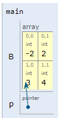
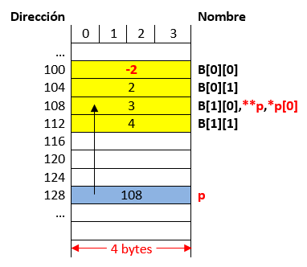

---
jupytext:
  cell_metadata_filter: -all
  formats: md:myst
  text_representation:
    extension: .md
    format_name: myst
    format_version: 0.13
    jupytext_version: 1.11.5
kernelspec:
  display_name: Python 3
  language: python
  name: python3
---

# Apuntadores y arreglos multidimensionales

```{admonition} Objetivos
* Introducir el concepto, manipulacion y uso de los arreglos multidimensionales.
* Tratar mas aplicaciones de los apuntadores.
```

## 1. Arreglos multidimensionales en C

A diferencia de los vectores, los arreglos multidimensionales (tambien conocidos como) se caracterizan por que manejan mas de un indice. Respecto a la manipulación, no existen considerables diferencias con java, sin embargo, a modo de repaso vamos a introducir algunos conceptos de repaso.

### 1.1. Declaración

Aqui se establecen ls dimensiones de cada componente, las formas mas comunes siguen una sintaxis como la siguiente:

**Caso para un arreglo de dos dimensiones**

```{code-block} c
// Arreglo de dos dimensiones
arrayType  arrayName[Rows][Columns];
```

**Caso para un arreglo de tres dimensiones**

```{code-block} c
// Arreglo de tres dimensiones
arrayType  arrayName[Planes][Rows ][Columns];
```

**Caso para un arreglo de N dimensiones**

```{code-block} c
// Arreglo de N dimensiones
arrayType  arrayName[Dim1][Dim2]...[DimN];
```

**Ejemplos**

1. El siguiente código muestra como crear matrices sin inicializar.

   ```{code-block} c
   int A[2][3];
   float B[3][1];

   int main() {
     char C[2][3][4];
     return 0;
   }
   ``` 
   
   La simulación se muestra a continuación:

   <iframe width="800" height="500" frameborder="0" src="https://pythontutor.com/iframe-embed.html#code=int%20A%5B2%5D%5B3%5D%3B%0Afloat%20B%5B3%5D%5B1%5D%3B%0A%0Aint%20main%28%29%20%7B%0A%20%20char%20C%5B2%5D%5B3%5D%5B4%5D%3B%0A%20%20return%200%3B%0A%7D&codeDivHeight=400&codeDivWidth=350&cumulative=false&curInstr=0&heapPrimitives=nevernest&origin=opt-frontend.js&py=c_gcc9.3.0&rawInputLstJSON=%5B%5D&textReferences=false"> </iframe>

   La salida es como se muestra a continuacion:

   ```{figure} ./local/img/CH_02-S03-fig1.png
   ---
   name: matrix_1
   ---
   Declaración de varios arreglos multidimensionales.
   ```

   ```{note} 
   Los valores de los componentes de un arreglo declarado como variable global se inicializan en 0. Cuando la declaración del arreglo se hace local, los valores de los componentes del arreglo si inicializan como valores desconocidos.
   ```   

2. A veces, puede ser util **inicializar** una matrix al declararla, a continuacion se muestran algunos ejemplos. El muestra un ejemplo para este caso.

   ```{code-block} c 
   #include <stdio.h>

   int matrix1[][4] = {
                       {4, 2, 7, 3},
                       {6, 1, 9, 5},
                       {8, 5, 0, 1}  
                      };


   int main() {
     int matrix2[2][2] = {{1, 2}, {3, 4}};
     int matrix3[2][2] = {{1}, {3, 4}}; 
     int matrix4[3][5]={1, 2, 3, 4, 5, 6, 7, 8, 9, 10, 11, 12, 13, 14, 15};
     int matrix5[][3]={1, 2, 3, 4};
     return 0;
   }
   ```

   El código anterior se puede simular a continuación:

   <iframe width="800" height="500" frameborder="0" src="https://pythontutor.com/iframe-embed.html#code=%23include%20%3Cstdio.h%3E%0A%0Aint%20matrix1%5B%5D%5B4%5D%20%3D%20%7B%0A%20%20%20%20%20%20%20%20%20%20%20%20%20%20%20%20%20%20%20%20%7B4,%202,%207,%203%7D,%0A%20%20%20%20%20%20%20%20%20%20%20%20%20%20%20%20%20%20%20%20%7B6,%201,%209,%205%7D,%0A%20%20%20%20%20%20%20%20%20%20%20%20%20%20%20%20%20%20%20%20%7B8,%205,%200,%201%7D%20%20%0A%20%20%20%20%20%20%20%20%20%20%20%20%20%20%20%20%20%20%7D%3B%0A%0A%0Aint%20main%28%29%20%7B%0A%20%20int%20matrix2%5B2%5D%5B2%5D%20%3D%20%7B%7B1,%202%7D,%20%7B3,%204%7D%7D%3B%0A%20%20int%20matrix3%5B2%5D%5B2%5D%20%3D%20%7B%7B1%7D,%20%7B3,%204%7D%7D%3B%20%0A%20%20int%20matrix4%5B3%5D%5B5%5D%3D%7B1,%202,%203,%204,%205,%206,%207,%208,%209,%2010,%2011,%2012,%2013,%2014,%2015%7D%3B%0A%20%20int%20matrix5%5B%5D%5B3%5D%3D%7B1,%202,%203,%204%7D%3B%0A%20%20return%200%3B%0A%7D&codeDivHeight=400&codeDivWidth=350&cumulative=false&curInstr=0&heapPrimitives=nevernest&origin=opt-frontend.js&py=c_gcc9.3.0&rawInputLstJSON=%5B%5D&textReferences=false"> </iframe>

   La representación en memoria de las matrices declaradas en el ejercicio anterior se muestra a continuación

   ```{figure} ./local/img/CH_02-S03-fig2.png
   ---
   name: matrix_2
   ---
   Declaración e inicialización de varios arreglos multidimensionales.
   ```

   ```{warning} 
   Al inicializar una matrix se debe pasar como minimo la dimension de las columnas (para el caso de dos dimensiones), si no se hace el compilador no sera capaz de deducir el tamaño de la matriz y se producira un error.
   ```

### 1.2. Manipulación de los arreglos multimensionales

Como en java, el uso de ciclos anidados es fundamentar para el movimiento a traves de cada uno de los elementos de la matrix. Generalmente, las varibles que controlan los ciclos seran empleados como subindices para barrer las matrices. A continuación se muestra un código para refrescar el concepto:

```{code-block} c
#include <stdio.h>

#define F 3
#define C 4


int main() {
  int M[F][C] = {
                  {4, 2, 7, 3},
                  {6, 1, 9, 5},
                  {8, 5, 0, 1}  
                };
  
  printf("Barriendo por filas: \n");
  for(int i = 0; i < F; i++) {
    printf("Fila %d: ",i);
    for(int j = 0; j < C; j++) {
      printf("%d ",M[i][j]);
    }
    printf("\n");
  }
  printf("\nBarriendo por columnas: \n");
  for(int i = 0; i < C; i++) {
    printf("Columna %d: ",i);
    for(int j = 0; j < F; j++) {
      printf("%d ",M[j][i]);
    }
    printf("\n");
  }
  return 0;
}
```

A continuación se puede simular el código anterior:

<iframe width="800" height="500" frameborder="0" src="https://pythontutor.com/iframe-embed.html#code=%23include%20%3Cstdio.h%3E%0A%0A%23define%20F%203%0A%23define%20C%204%0A%0A%0Aint%20main%28%29%20%7B%0A%20%20int%20M%5BF%5D%5BC%5D%20%3D%20%7B%0A%20%20%20%20%20%20%20%20%20%20%20%20%20%20%20%20%20%20%7B4,%202,%207,%203%7D,%0A%20%20%20%20%20%20%20%20%20%20%20%20%20%20%20%20%20%20%7B6,%201,%209,%205%7D,%0A%20%20%20%20%20%20%20%20%20%20%20%20%20%20%20%20%20%20%7B8,%205,%200,%201%7D%20%20%0A%20%20%20%20%20%20%20%20%20%20%20%20%20%20%20%20%7D%3B%0A%20%20%0A%20%20printf%28%22Barriendo%20por%20filas%3A%20%5Cn%22%29%3B%0A%20%20for%28int%20i%20%3D%200%3B%20i%20%3C%20F%3B%20i%2B%2B%29%20%7B%0A%20%20%20%20printf%28%22Fila%20%25d%3A%20%22,i%29%3B%0A%20%20%20%20for%28int%20j%20%3D%200%3B%20j%20%3C%20C%3B%20j%2B%2B%29%20%7B%0A%20%20%20%20%20%20printf%28%22%25d%20%22,M%5Bi%5D%5Bj%5D%29%3B%0A%20%20%20%20%7D%0A%20%20%20%20printf%28%22%5Cn%22%29%3B%0A%20%20%7D%0A%20%20printf%28%22%5CnBarriendo%20por%20columnas%3A%20%5Cn%22%29%3B%0A%20%20for%28int%20i%20%3D%200%3B%20i%20%3C%20C%3B%20i%2B%2B%29%20%7B%0A%20%20%20%20printf%28%22Columna%20%25d%3A%20%22,i%29%3B%0A%20%20%20%20for%28int%20j%20%3D%200%3B%20j%20%3C%20F%3B%20j%2B%2B%29%20%7B%0A%20%20%20%20%20%20printf%28%22%25d%20%22,M%5Bj%5D%5Bi%5D%29%3B%0A%20%20%20%20%7D%0A%20%20%20%20printf%28%22%5Cn%22%29%3B%0A%20%20%7D%0A%20%20return%200%3B%0A%7D&codeDivHeight=400&codeDivWidth=350&cumulative=false&curInstr=0&heapPrimitives=nevernest&origin=opt-frontend.js&py=c_gcc9.3.0&rawInputLstJSON=%5B%5D&textReferences=false"> </iframe>

En la siguiente figura se muestra el resultado del código anterior.

```{figure} ./local/img/CH_02-S03-fig3_0.png
---
name: matrix_3
---
Recorrido de un array multidimensional.
```

### 1.3. Funciones y arreglos multidimensionales

Es posible pasar arreglos multidimensionales como parametros de funciones. Cuando se pasa un array multidimensional, la primera dimension del array no tiene que ser especificada pero la segunda dimension (y cualquier subsecuente) deberá ser dada. A continuacion se muestran diferentes casos de uso cuando se emplean funciones con arreglos multidimensionales.

#### Caso 1 - Cuando las dimensiones de la matrix estan disponibles globalmente 

Las dimensiones pueden ser constantes globales o macros. A continuación se muestra en caso específico en el que se crea una función para imprimir una matrix 2D. Veamos el código asociado:

```{code-block} c
#include <stdio.h>

#define M 3
#define N 3
 
void print(int arr[M][N]);
 
int main()
{
    int arr[][N] = {{1, 2, 3}, {4, 5, 6}, {7, 8, 9}};
    print(arr);
    return 0;
}

void print(int arr[M][N]) {
    int i, j;
    for (i = 0; i < M; i++) {
      printf("[ ");
      for (j = 0; j < N; j++) {
        printf("%d ", arr[i][j]);
      }
      printf("]\n");
    }
}
```

A continuación, se muestra la simulación del codigo anterior:

<iframe width="800" height="500" frameborder="0" src="https://pythontutor.com/iframe-embed.html#code=%23include%20%3Cstdio.h%3E%0A%0A%23define%20M%203%0A%23define%20N%203%0A%20%0Avoid%20print%28int%20arr%5BM%5D%5BN%5D%29%3B%0A%20%0Aint%20main%28%29%0A%7B%0A%20%20%20%20int%20arr%5B%5D%5BN%5D%20%3D%20%7B%7B1,%202,%203%7D,%20%7B4,%205,%206%7D,%20%7B7,%208,%209%7D%7D%3B%0A%20%20%20%20print%28arr%29%3B%0A%20%20%20%20return%200%3B%0A%7D%0A%0Avoid%20print%28int%20arr%5BM%5D%5BN%5D%29%20%7B%0A%20%20%20%20int%20i,%20j%3B%0A%20%20%20%20for%20%28i%20%3D%200%3B%20i%20%3C%20M%3B%20i%2B%2B%29%20%7B%0A%20%20%20%20%20%20printf%28%22%5B%20%22%29%3B%0A%20%20%20%20%20%20for%20%28j%20%3D%200%3B%20j%20%3C%20N%3B%20j%2B%2B%29%20%7B%0A%20%20%20%20%20%20%20%20printf%28%22%25d%20%22,%20arr%5Bi%5D%5Bj%5D%29%3B%0A%20%20%20%20%20%20%7D%0A%20%20%20%20%20%20printf%28%22%5D%5Cn%22%29%3B%0A%20%20%20%20%7D%0A%7D&codeDivHeight=400&codeDivWidth=350&cumulative=false&curInstr=0&heapPrimitives=nevernest&origin=opt-frontend.js&py=c_gcc9.3.0&rawInputLstJSON=%5B%5D&textReferences=false"> </iframe>

#### Caso 2 - Cuando solo la segunda dimension de la matrix esta disponible globalmente 

Esta puede ser un constante global o una macro. Pese a que se omite la primera dimension de la matrix, esta debe ser usada como un parametro formal de la función con el objetivo de conocer la expención de la primera dimensión. Veamos el mismo ejemplo anterior teniendo en cuenta este caso:

```{code-block} c
#include <stdio.h>

#define N 3
 
void print(int arr[][N], int m); 
 
int main()
{
    int arr[][N] = {{1, 2, 3}, {4, 5, 6}, {7, 8, 9}};
    print(arr,3);
    return 0;
}

void print(int arr[][N], int m) {
    int i, j;
    for (i = 0; i < m; i++) {
      printf("[ ");
      for (j = 0; j < N; j++) {
        printf("%d ", arr[i][j]);
      }
      printf("]\n");
    }
}
```

A continuación, se muestra la simulación del codigo anterior:

<iframe width="800" height="500" frameborder="0" src="https://pythontutor.com/iframe-embed.html#code=%23include%20%3Cstdio.h%3E%0A%0A%23define%20N%203%0A%20%0Avoid%20print%28int%20arr%5B%5D%5BN%5D,%20int%20m%29%3B%20%0A%20%0Aint%20main%28%29%0A%7B%0A%20%20%20%20int%20arr%5B%5D%5BN%5D%20%3D%20%7B%7B1,%202,%203%7D,%20%7B4,%205,%206%7D,%20%7B7,%208,%209%7D%7D%3B%0A%20%20%20%20print%28arr,3%29%3B%0A%20%20%20%20return%200%3B%0A%7D%0A%0Avoid%20print%28int%20arr%5B%5D%5BN%5D,%20int%20m%29%20%7B%0A%20%20%20%20int%20i,%20j%3B%0A%20%20%20%20for%20%28i%20%3D%200%3B%20i%20%3C%20m%3B%20i%2B%2B%29%20%7B%0A%20%20%20%20%20%20printf%28%22%5B%20%22%29%3B%0A%20%20%20%20%20%20for%20%28j%20%3D%200%3B%20j%20%3C%20N%3B%20j%2B%2B%29%20%7B%0A%20%20%20%20%20%20%20%20printf%28%22%25d%20%22,%20arr%5Bi%5D%5Bj%5D%29%3B%0A%20%20%20%20%20%20%7D%0A%20%20%20%20%20%20printf%28%22%5D%5Cn%22%29%3B%0A%20%20%20%20%7D%0A%7D&codeDivHeight=400&codeDivWidth=350&cumulative=false&curInstr=0&heapPrimitives=nevernest&origin=opt-frontend.js&py=c_gcc9.3.0&rawInputLstJSON=%5B%5D&textReferences=false"> </iframe>

#### Caso 3 - Pasando matrices de cualquier dimension

Notese que una de las limitaciones de los dos metodos anteriores, es que el tamaño de ambas (caso 1) o al menos una de las dimensiones de la matrix es fijo (columnas de la matrix para el caso 2). Sin embargo desde C99, C soporta que matrices de tamaño variable puedan ser pasadas al especificar las dimensiones de la variable. A continuacion de muestra el caso para el mismo ejemplo analizado (ver el siguiente código):

```{code-block} c
#include <stdio.h>

void print(int m, int n, int arr[][n]);
 
int main()
{
    int arr[][3] = {{1, 2, 3}, {4, 5, 6}, {7, 8, 9}};
    int F = 3, C = 3;
    print(F, C, arr);
    return 0;
}

void print(int m, int n, int arr[][n]) {
    int i, j;
    for (i = 0; i < m; i++) {
      printf("[ ");
      for (j = 0; j < n; j++) {
        printf("%d ", arr[i][j]);
      }
      printf("]\n");
    }
}
```

A continuación, se muestra la simulación del codigo anterior:

<iframe width="800" height="500" frameborder="0" src="https://pythontutor.com/iframe-embed.html#code=%23include%20%3Cstdio.h%3E%0A%0Avoid%20print%28int%20m,%20int%20n,%20int%20arr%5B%5D%5Bn%5D%29%3B%0A%20%0Aint%20main%28%29%0A%7B%0A%20%20%20%20int%20arr%5B%5D%5B3%5D%20%3D%20%7B%7B1,%202,%203%7D,%20%7B4,%205,%206%7D,%20%7B7,%208,%209%7D%7D%3B%0A%20%20%20%20int%20F%20%3D%203,%20C%20%3D%203%3B%0A%20%20%20%20print%28F,%20C,%20arr%29%3B%0A%20%20%20%20return%200%3B%0A%7D%0A%0Avoid%20print%28int%20m,%20int%20n,%20int%20arr%5B%5D%5Bn%5D%29%20%7B%0A%20%20%20%20int%20i,%20j%3B%0A%20%20%20%20for%20%28i%20%3D%200%3B%20i%20%3C%20m%3B%20i%2B%2B%29%20%7B%0A%20%20%20%20%20%20printf%28%22%5B%20%22%29%3B%0A%20%20%20%20%20%20for%20%28j%20%3D%200%3B%20j%20%3C%20n%3B%20j%2B%2B%29%20%7B%0A%20%20%20%20%20%20%20%20printf%28%22%25d%20%22,%20arr%5Bi%5D%5Bj%5D%29%3B%0A%20%20%20%20%20%20%7D%0A%20%20%20%20%20%20printf%28%22%5D%5Cn%22%29%3B%0A%20%20%20%20%7D%0A%7D&codeDivHeight=400&codeDivWidth=350&cumulative=false&curInstr=0&heapPrimitives=nevernest&origin=opt-frontend.js&py=c_gcc9.3.0&rawInputLstJSON=%5B%5D&textReferences=false"> </iframe>

Finalmante, para todos los casos anteriormente expuestos, la salida es la siguiente:

```{figure} ./local/img/CH_02-S03-fig3.png
---
name: matrix_4
---
Salida de todos los casos previamente tratados.
```

```{important} 
Como anotación importante, de todos los parámetros pasados a la función el último debe ser la matriz, pues como usa como dimensión para las columnas otra variable, si esta no esta previamente declarada se generara un error; de este modo poner la matrix de último evita este problema.
```

Otra forma de pasar matrices a funciones es empleando apuntadores, pero esto ser visto posteriormente.

## 2. Apuntadores y matrices

Así como en el caso de los arreglos de una dimensión, es posible representar los arreglos multidimensionales con una notación de punteros equivalente. 

En el caso de las matrices de dos dimensiones, cuando estas se almacenan en memoria, la forma como la memoria se llena es fila por fila, es decir si se tiene una matriz de `n` filas por `m` columnas las primeras `m` posiciones en memoria corresponden a los `m` elementos de la primera fila, las `m` posiciones siguientes corresponden a los `m` elementos de la siguiente fila y así sucesivamente hasta que todas las filas son ocupadas (`n*m` posiciones de memoria). La siguiente figura muestra esto:

|Representacion de la matrix | Representacion en memoria|
|---|---|
| <br>`short a[3][2] = {`<br>`                   {101,51},`<br>`                   {102,67},`<br>`                   {103,76}`<br>`                 };` <br><br>Para el caso vamos a suponer que cada dato tipo short ocupa `2 bytes`.||

A continuación, se muestran varios ejemplos para reforzar el concepto anteriormente descrito.

### Ejemplos

#### Ejemplo 1

Para el caso, dado el siguiente código ([simulación](https://pythontutor.com/render.html#code=%23include%20%3Cstdio.h%3E%0A%0Aint%20main%28%29%20%7B%0A%20%20int%20matrix%5B2%5D%5B5%5D%20%3D%20%7B%0A%20%20%20%20%20%20%20%20%20%20%20%20%20%20%20%20%20%20%20%20%20%20%20%7B1,2,3,4,5%7D,%0A%20%20%20%20%20%20%20%20%20%20%20%20%20%20%20%20%20%20%20%20%20%20%20%7B6,7,8,9,10%7D%0A%20%20%20%20%20%20%20%20%20%20%20%20%20%20%20%20%20%20%20%20%20%7D%3B%0A%0A%20%20for%28int%20i%20%3D%200%3B%20i%20%3C%202%3B%20i%2B%2B%29%20%7B%0A%20%20%20%20for%28int%20j%20%3D%200%3B%20j%20%3C%205%3B%20j%2B%2B%29%20%7B%0A%20%20%20%20%20%20printf%28%22matrix%5B%25d%5D%5B%25d%5D%20-%3E%20Address%3A%20%25p,%20Value%3A%20%25d%5Cn%22,%5C%0A%20%20%20%20%20%20%20%20%20%20%20%20%20i,j,%26matrix%5Bi%5D%5Bj%5D,matrix%5Bi%5D%5Bj%5D%29%3B%0A%20%20%20%20%7D%20%20%20%20%0A%20%20%7D%0A%20%20return%200%3B%0A%7D&cumulative=false&curInstr=0&heapPrimitives=nevernest&mode=display&origin=opt-frontend.js&py=c_gcc9.3.0&rawInputLstJSON=%5B%5D&textReferences=false)).
   
```{code-block} c
#include <stdio.h>

int main() {
  int matrix[2][5] = {
                       {1,2,3,4,5},
                       {6,7,8,9,10}
                     };

  for(int i = 0; i < 2; i++) {
    for(int j = 0; j < 5; j++) {
      printf("matrix[%d][%d] -> Address: %p, Value: %d\n",\
              i,j,&matrix[i][j],matrix[i][j]);
      }    
    }
  return 0;
}
```

La salida del programa se muestra a continuación:

```{figure} ./local/img/CH_02-S03-fig5.png
---
name: matrix_5
---
Salida del programa.
```

De modo que segun lo anterior, la representacion en memoria de la matrix será:

```{figure} ./local/img/CH_02-S03-fig6.png
---
name: matrix_6
---
Representación de la matrix en memoria.
```
   
Así mismo, un arreglo de dos dimensiones puede ser tratado como un arreglo de una dimensión cuyos elementos son arreglos de una dimensión (las filas). Esto es resaltado en la siguiente figura para la matrix anteriormente definida:

```{figure} ./local/img/CH_02-S03-fig7.png
---
name: matrix_7
---
Representación de la matrix como arreglos de una dimension asociada a  cada una de las filas.
```

#### Ejemplo 2

Se tiene el siguiente codigo fuente ([simulación](https://pythontutor.com/render.html#code=%23include%20%3Cstdio.h%3E%0A%0Aint%20main%28%29%20%7B%0A%20%20int%20mat%5B%5D%5B3%5D%20%3D%20%7B%7B1,2,3%7D,%7B4,5,6%7D,%7B7,8,9%7D%7D%3B%0A%20%20/*%20Analisis%20del%20elemento%20mat%5B0%5D%5B0%5D%20*/%0A%20%20printf%28%22mat%3A%20%25p%5Cn%22,%20mat%29%3B%20//%20D%0A%20%20printf%28%22*mat%3A%20%25p%5Cn%22,%20*mat%29%3B%20//%20D%0A%20%20//%20-----------------------------------------------------%0A%20%20printf%28%22mat%5B0%5D%3A%20%25p%5Cn%22,mat%5B0%5D%29%3B%20//%20D%0A%20%20printf%28%22%26mat%5B0%5D%5B0%5D%3A%20%25p%5Cn%22,%26mat%5B0%5D%5B0%5D%29%3B%20//%20D%0A%20%20printf%28%22**mat%3A%20%25d%5Cn%22,**mat%29%3B%20//%20V%0A%20%20printf%28%22*%28mat%5B0%5D%29%3A%20%25d%5Cn%22,*%28mat%5B0%5D%29%29%3B%20//%20V%0A%20%20printf%28%22*%28%26mat%5B0%5D%5B0%5D%29%3A%20%25d%5Cn%22,*%28%26mat%5B0%5D%5B0%5D%29%29%3B%20//%20V%0A%20%20printf%28%22---------------------%5Cn%22%29%3B%0A%20%20/*%20Analisis%20del%20elemento%20mat%5B1%5D%5B0%5D%20*/%0A%20%20printf%28%22mat%5B1%5D%3A%20%25p%5Cn%22,mat%5B1%5D%29%3B%20//%20D%0A%20%20printf%28%22%26mat%5B1%5D%5B0%5D%3A%20%25p%5Cn%22,%26mat%5B1%5D%5B0%5D%29%3B%20//%20D%0A%20%20printf%28%22mat%5B1%5D%5B0%5D%3A%20%25d%5Cn%22,mat%5B1%5D%5B0%5D%29%3B%20//%20V%0A%20%20printf%28%22*mat%5B1%5D%3A%20%25d%5Cn%22,*mat%5B1%5D%29%3B%20//%20V%0A%20%20printf%28%22*%28%26mat%5B1%5D%5B0%5D%29%3A%20%25d%5Cn%22,*%28%26mat%5B1%5D%5B0%5D%29%29%3B%20//%20V%0A%20%20printf%28%22---------------------%5Cn%22%29%3B%0A%20%20/*%20Analisis%20del%20elemento%20mat%5B2%5D%5B1%5D%20*/%0A%20%20printf%28%22%26mat%5B2%5D%5B1%5D%3A%20%25p%5Cn%22,%26mat%5B2%5D%5B1%5D%29%3B%20//%20D%0A%20%20printf%28%22mat%5B2%5D%20%2B%201%3A%20%25p%5Cn%22,mat%5B2%5D%20%2B%201%29%3B%20//%20D%0A%20%20printf%28%22mat%5B2%5D%5B1%5D%3A%20%25d%5Cn%22,mat%5B2%5D%5B1%5D%29%3B%20//%20V%0A%20%20printf%28%22*%28mat%5B2%5D%20%2B%201%29%3A%20%25d%5Cn%22,*%28mat%5B2%5D%20%2B%201%29%29%3B%20//%20V%0A%20%20printf%28%22*%28*%28mat%20%2B%202%29%20%2B%201%29%3A%20%25d%5Cn%22,*%28*%28mat%20%2B%202%29%20%2B%201%29%29%3B%20//%20V%0A%20%20return%200%3B%0A%7D&cumulative=false&curInstr=0&heapPrimitives=nevernest&mode=display&origin=opt-frontend.js&py=c_gcc9.3.0&rawInputLstJSON=%5B%5D&textReferences=false))

```{code-block} c
#include <stdio.h>

int main() {
  int mat[][3] = {{1,2,3},{4,5,6},{7,8,9}};
  /* Analisis del elemento mat[0][0] */
  printf("mat: %p\n", mat); // D
  printf("*mat: %p\n", *mat); // D
  // -----------------------------------------------------
  printf("mat[0]: %p\n",mat[0]); // D
  printf("&mat[0][0]: %p\n",&mat[0][0]); // D
  printf("**mat: %d\n",**mat); // V
  printf("*(mat[0]): %d\n",*(mat[0])); // V
  printf("*(&mat[0][0]): %d\n",*(&mat[0][0])); // V
  printf("---------------------\n");
  /* Analisis del elemento mat[1][0] */
  printf("mat[1]: %p\n",mat[1]); // D
  printf("&mat[1][0]: %p\n",&mat[1][0]); // D
  printf("mat[1][0]: %d\n",mat[1][0]); // V
  printf("*mat[1]: %d\n",*mat[1]); // V
  printf("*(&mat[1][0]): %d\n",*(&mat[1][0])); // V
  printf("---------------------\n");
  /* Analisis del elemento mat[2][1] */
  printf("&mat[2][1]: %p\n",&mat[2][1]); // D
  printf("mat[2] + 1: %p\n",mat[2] + 1); // D
  printf("mat[2][1]: %d\n",mat[2][1]); // V
  printf("*(mat[2] + 1): %d\n",*(mat[2] + 1)); // V
  printf("*(*(mat + 2) + 1): %d\n",*(*(mat + 2) + 1)); // V
  return 0;
}
```

La salida del codigo anterior se muestra a continuación:


```{figure} ./local/img/CH_02-S03-fig8.png
---
name: matrix_8
---
Salida del codigo anterior.
```

Teniendo en cuenta el resultado de la figura anterior y representando la matrix como un vector de arreglos se tiene la siguiente figura (notese que se resaltan los elementos asociados a las salidas en pantalla del programa anterior):


```{figure} ./local/img/CH_02-S03-fig9.png
---
name: matrix_9
---
Representacion de la matrix como un vector de arrays.
```

Ademas, la representación en memoria se muestra a continuación:

```{figure} ./local/img/CH_02-S03-fig10.png
---
name: matrix_10
---
Representacion en memoria de la matrix de la figura anterior.
```

La siguiente figura resalta la comparación de la salida en pantalla con el mapa de memoria resaltando las equivalencias a las que se llega:

```{figure} ./local/img/CH_02-S03-fig11.png
---
name: matrix_11
---
Equivalencias.
```

Teniendo en cuenta lo anterior, se pueden llegar a las siguientes equivalencias mas generales, las cuales se muestran en la siguiente tabla:

|Equivalencias |	Expresión|
|---|---|
|**De valor**|Obteniendo el valor de una matriz en la posicion `(i,j)`: <br><br> `A[i][j] = *(A+i)[j] = *(*(A+i)+ j) = *(A[i] + j)`|
|**De dirección**|Obteniendo la direccion de una matriz en la posicion `(i,j)`: <br><br> `&A[i][j] = (A+i)[j] = *(A+i) + j = A[i] + j`<br><br>**Otra alternativa**:<br><br>`&A[i][j] = &A[0][0] + i*N_COLUMNAS + j`<br><br> En lo que respecta a obtener el posición de una fila `i`, lo cual se da cuando `j = 0`: `&A[i][0] = A[i] + 0 = A[i]`|
|**Anotaciones**|`&A[0][0] = A = A[0] = &A[0]`<br><br>Pero ojo que las anteriores equivalencias no son intercambiables: <ul><li>`&A[0][0] + 1`, apunta a `A[0][1]` </li> <li> `A[0] + 1`, apunta a `A[0][1]` </li> <li> `A + 1`, apunta a `A[1][0]` </li><li> `&A[0] + 1`, apunta a `A[1][0]`</li></ul>|

Es posible definir un arreglo de dos dimensiones como un apuntador a un grupo de arreglos de una dimensión, de modo que una declaración de un arreglo bidimensional puede ser hecha de la siguiente manera:

```{code-block} c
T *(ptVar)[m];
```

Donde **`T`** está asociado al tipo de dato (el cual puede ser simple o compuesto) y **`n`** es el número de filas del array bidimensional y **`m`** es el número de elementos que habrá en la fila. La expresión anterior puede ser por lo tanto una alternativa a la declaración típica de matrices por ejemplo para el caso de una matriz de `n` filas por `m` columnas como la siguiente:

```{code-block} c
T mat[n][m];
```

La expresión anterior se puede generalizar a arreglos de más elementos tal de modo que para una matriz de dimensión `N`:

```{code-block} c
T mat[val1]...[val_N];
```

De modo que la expresión alternativa estará dada por:

```{code-block} c
T *(ptVar)[val_2][val_3]...[val_N];
```

Donde `T` se refiere al tipo de dato y las expresiones `val_1`, `val_2`,..., `val_N` se refieren al número máximo de elementos asociados con cada uno de los `N` subíndices del array. 

Otra cosa importante es la presencia del paréntesis, este es necesario ya que si no está, no nos estaríamos refiriendo a un apuntador a un grupo de arrays  sino a un array de apuntadores, esto porque los `[]` tienen mayor precedencia que el `*`. Así según lo anterior:

```{code-block} c
int (*pz)[2]; // Crea un apuntador a un array de 2 enteros.
int *pax[2]; // Crea un array de dos punteros a enteros.
```

Para aterrizar el concepto anterior vamos a analizar el siguiente ejemplo.

#### Ejemplo 3

Dado el siguiente fragmento de código ([simulación](https://pythontutor.com/render.html#code=%23include%20%3Cstdio.h%3E%0A%0Aint%20main%28%29%20%7B%0A%20%20int%20A%5B3%5D%5B2%5D%20%3D%20%7B%7B1,2%7D,%7B3,4%7D,%7B5,6%7D%7D%3B%0A%20%20int%20%28*pz%29%5B2%5D%3B%0A%20%20pz%20%3D%20A%3B%0A%20%20printf%28%22A%5B0%5D%5B0%5D%3A%20%25d%5Cn%22,%20A%5B0%5D%5B0%5D%29%3B%20//%20V%0A%20%20printf%28%22**pz%3A%20%25d%5Cn%22,%20**pz%29%3B%20//%20V%0A%20%20printf%28%22*pz%5B0%5D%3A%20%25d%5Cn%22,%20*pz%5B0%5D%29%3B%20//%20V%0A%20%20printf%28%22%28*pz%29%5B0%5D%3A%20%25d%5Cn%22,%20%28*pz%29%5B0%5D%29%3B%20//%20V%0A%20%20printf%28%22%26A%5B0%5D%5B0%5D%3A%20%25p%5Cn%22,%20%26A%5B0%5D%5B0%5D%29%3B%20//%20M%0A%20%20printf%28%22*pz%3A%20%25p%5Cn%22,%20*pz%29%3B%20//%20M%0A%20%20printf%28%22pz%5B0%5D%3A%20%25p%5Cn%22,%20pz%5B0%5D%29%3B%20//%20M%0A%20%20printf%28%22---------------------%5Cn%22%29%3B%0A%20%20printf%28%22A%5B1%5D%5B0%5D%3A%20%25d%5Cn%22,%20A%5B1%5D%5B0%5D%29%3B%20//%20V%0A%20%20printf%28%22*pz%5B1%5D%3A%20%25d%5Cn%22,%20*pz%5B1%5D%29%3B%20//%20V%0A%20%20printf%28%22*%28pz%5B1%5D%2B0%29%3A%20%25d%5Cn%22,%20*%28pz%5B1%5D%2B0%29%29%3B%20//%20V%0A%20%20printf%28%22*%28*%28pz%20%2B%201%29%2B0%29%3A%20%25d%5Cn%22,%20*%28*%28pz%20%2B1%20%29%2B0%29%29%3B%20//%20V%0A%20%20printf%28%22%26A%5B1%5D%5B0%5D%3A%20%25p%5Cn%22,%20%26A%5B1%5D%5B0%5D%29%3B%20//%20M%0A%20%20printf%28%22pz%20%2B%201%3A%20%25p%5Cn%22,%20pz%20%2B%201%29%3B%20//%20M%0A%20%20printf%28%22pz%5B1%5D%3A%20%25p%5Cn%22,%20pz%5B1%5D%29%3B%20//%20M%0A%20%20printf%28%22---------------------%5Cn%22%29%3B%0A%20%20printf%28%22A%5B2%5D%5B1%5D%3A%20%25d%5Cn%22,%20A%5B2%5D%5B1%5D%29%3B%0A%20%20printf%28%22*%28pz%5B2%5D%20%2B%201%29%3A%20%25d%5Cn%22,%20*%28pz%5B2%5D%20%2B%201%29%29%3B%0A%20%20printf%28%22*%28*%28pz%20%2B%202%29%20%2B%201%29%3A%20%25d%5Cn%22,%20*%28*%28pz%20%2B%202%29%20%2B%201%29%29%3B%0A%20%20printf%28%22%26A%5B2%5D%5B1%5D%3A%20%25p%5Cn%22,%20%26A%5B2%5D%5B1%5D%29%3B%20%20%0A%20%20printf%28%22pz%5B2%5D%20%2B%201%3A%20%25p%5Cn%22,%20pz%5B2%5D%20%2B%201%29%3B%0A%20%20return%200%3B%0A%7D&cumulative=false&curInstr=0&heapPrimitives=nevernest&mode=display&origin=opt-frontend.js&py=c_gcc9.3.0&rawInputLstJSON=%5B%5D&textReferences=false)), hacer el respectivo analisis:

```{code-block} c
#include <stdio.h>

int main() {
  int A[3][2] = {{1,2},{3,4},{5,6}};
  int (*pz)[2];
  pz = A;
  printf("A[0][0]: %d\n", A[0][0]); // V
  printf("**pz: %d\n", **pz); // V
  printf("*pz[0]: %d\n", *pz[0]); // V
  printf("(*pz)[0]: %d\n", (*pz)[0]); // V
  printf("&A[0][0]: %p\n", &A[0][0]); // M
  printf("*pz: %p\n", *pz); // M
  printf("pz[0]: %p\n", pz[0]); // M
  printf("---------------------\n");
  printf("A[1][0]: %d\n", A[1][0]); // V
  printf("*pz[1]: %d\n", *pz[1]); // V
  printf("*(pz[1]+0): %d\n", *(pz[1]+0)); // V
  printf("*(*(pz + 1)+0): %d\n", *(*(pz +1 )+0)); // V
  printf("&A[1][0]: %p\n", &A[1][0]); // M
  printf("pz + 1: %p\n", pz + 1); // M
  printf("pz[1]: %p\n", pz[1]); // M
  printf("---------------------\n");
  printf("A[2][1]: %d\n", A[2][1]);
  printf("*(pz[2] + 1): %d\n", *(pz[2] + 1));
  printf("*(*(pz + 2) + 1): %d\n", *(*(pz + 2) + 1));
  printf("&A[2][1]: %p\n", &A[2][1]);  
  printf("pz[2] + 1: %p\n", pz[2] + 1);
  return 0;
}
```

La salida del código anterior se muestra a continuación:

```{figure} ./local/img/CH_02-S03-fig13.png
---
name: matrix_12
---
Resultado del ejemplo 3.
```

Por otro lado, la representacion en memoria y como arreglo de vectores de la matrix, con base en la figura anterior es se muestra a continuacion.

```{figure} ./local/img/CH_02-S03-fig14.png
---
name: matrix_13
---
Representacion en memomria de la matrix analizada en el ejemplo 3.
```

#### Ejemplo 4

Analizar el siguiente código ([simulación](https://pythontutor.com/render.html#code=int%20main%28%29%20%7B%0A%20%20int%20B%5B2%5D%5B2%5D%3D%20%7B1,%202,%203,%204%7D%3B%0A%20%20int%20%28*p%29%5B2%5D%3B%0A%20%20p%20%3D%20B%3B%0A%20%20**p%20%3D%20-%28*%28p%5B0%5D%20%2B%201%29%29%3B%0A%20%20p%2B%2B%3B%0A%20%20**p%20%3D%20*%28*p%20%2B%201%29%20%2B%201%3B%0A%20%20return%200%3B%0A%7D&cumulative=false&curInstr=0&heapPrimitives=nevernest&mode=display&origin=opt-frontend.js&py=c_gcc9.3.0&rawInputLstJSON=%5B%5D&textReferences=false)):

```{code-block} c
int main() {
  int B[2][2]= {1, 2, 3, 4};
  int (*p)[2];
  p = B;
  **p = -(*(p[0] + 1));
  p++;
  **p = *(*p + 1) + 1;
  return 0;
}
```

La siguiente tabla muestra el resultado de realizar la prueba de escritorio paso por paso (resaltando en negrita) la instruccion que esta ejecutandose. Asi mismo, se asumen que las direcciones estan en formato decimal y no hexadecimal.

|Instrucciones |	Representación |	Efecto en memoria |
|----|----|----|
|`int B[2][2]= {1, 2, 3, 4};` <br> **`int (*p)[2];`** <br>`p = B;` <br>`**p = -(*(p[0] + 1));` <br>`p++;` <br> `**p = *(*p + 1) + 1;`|||
|`int B[2][2]= {1, 2, 3, 4};` <br> `int (*p)[2];` <br>**`p = B;`** <br>`**p = -(*(p[0] + 1));` <br>`p++;` <br> `**p = *(*p + 1) + 1;`|||
|`int B[2][2]= {1, 2, 3, 4};` <br> `int (*p)[2];` <br>`p = B;` <br>**`**p = -(*(p[0] + 1));`** <br>`p++;` <br> `**p = *(*p + 1) + 1;`|||
|`int B[2][2]= {1, 2, 3, 4};` <br> `int (*p)[2];` <br>`p = B;` <br>`**p = -(*(p[0] + 1));` <br>**`p++;`** <br> `**p = *(*p + 1) + 1;`|||
|`int B[2][2]= {1, 2, 3, 4};` <br> `int (*p)[2];` <br>`p = B;` <br>`**p = -(*(p[0] + 1));` <br>`p++;` <br> **`**p = *(*p + 1) + 1;`**|||


#### Ejemplo 5

Se desea crear un array de bidimensional de `10` filas por `20` columnas llamado `x` esto puede ser hecho, así:

```{code-block} c
int (*x)[20]; // Apuntador a un grupo de 20 enteros contiguos de un array unidimensional
```

O así:

```{code-block} c
int x[10][20];
```

Esto se muestra en la siguiente grafica:

```{figure} ./local/img/CH_02-S03-fig20.png
---
name: matrix_14
---
Array bidimensional asociado a `x`.
```

Basicamente, lo que se quiere dar a entender con la grafica es que `x` apunta al primer array de `20` elementos, el cual es la primera fila (fila 0), del array original. De manera similar, `(x + 1)` apunta a los segundos `20` elementos del array (fila 1 del array original) y así sucesivamente hasta la última fila. Observe el siguiente código:

```{code-block} c
int main() {
  int (*y)[20];
  int x[10][20];
  y = x;
  for(int i = 0; i < 10; i++) {
    y = x + i;
  }
  return 0;
}
```

Para clarificar lo anterior ejecute la siguiente simulación:

<iframe width="800" height="500" frameborder="0" src="https://pythontutor.com/iframe-embed.html#code=int%20main%28%29%20%7B%0A%20%20int%20%28*y%29%5B20%5D%3B%0A%20%20int%20x%5B10%5D%5B20%5D%3B%0A%20%20y%20%3D%20x%3B%0A%20%20for%28int%20i%20%3D%200%3B%20i%20%3C%2010%3B%20i%2B%2B%29%20%7B%0A%20%20%20%20y%20%3D%20x%20%2B%20i%3B%0A%20%20%7D%0A%20%20return%200%3B%0A%7D&codeDivHeight=400&codeDivWidth=350&cumulative=false&curInstr=0&heapPrimitives=nevernest&origin=opt-frontend.js&py=c_gcc9.3.0&rawInputLstJSON=%5B%5D&textReferences=false"> </iframe>

La siguiente figura, muestra una de las salidas que se obtiene al simular:

```{figure} ./local/img/CH_02-S03-fig21.png
---
name: matrix_15
---
Array bidimensional asociado al codigo anterior.
```

#### Ejemplo 6

Considere una matriz de tres dimensiones con la siguiente declaración:

```{code-block} c
float t[3][4][5];   
```

O así:

```{code-block} c
float (*t)[4][5];     
```

En la declaración anterior, se definió a `t` como un apuntador a un grupo de `4x5` elementos contiguos de una matriz bidimensional. Por lo tanto según lo anterior, `t` apuntara a los primeros `4x5` elementos, `t + 1` apuntara a los segundos `4x5` elementos y así sucesivamente.

En el siguiente código se aterriza el concepto:

```{code-block} c

int main() {
  float t[3][4][5]; 
  float (*ptr1)[4][5];
  float (*ptr2)[4][5];
  float (*ptr3)[4][5];
  ptr1 = t;
  ptr2 = t + 1;
  ptr3 = t + 2;
  return 0;
}
```

La simulación del código anterior, puede ser realizada a continuación:

<iframe width="800" height="500" frameborder="0" src="https://pythontutor.com/iframe-embed.html#code=%0Aint%20main%28%29%20%7B%0A%20%20float%20t%5B3%5D%5B4%5D%5B5%5D%3B%20%0A%20%20float%20%28*ptr1%29%5B4%5D%5B5%5D%3B%0A%20%20float%20%28*ptr2%29%5B4%5D%5B5%5D%3B%0A%20%20float%20%28*ptr3%29%5B4%5D%5B5%5D%3B%0A%20%20ptr1%20%3D%20t%3B%0A%20%20ptr2%20%3D%20t%20%2B%201%3B%0A%20%20ptr3%20%3D%20t%20%2B%202%3B%0A%20%20return%200%3B%0A%7D&codeDivHeight=400&codeDivWidth=350&cumulative=false&curInstr=0&heapPrimitives=nevernest&origin=opt-frontend.js&py=c_gcc9.3.0&rawInputLstJSON=%5B%5D&textReferences=false"> </iframe>

La salida de muestra a continuación:

```{figure} ./local/img/CH_02-S03-fig22.png
---
name: matrix_16
---
Array tridimensional asociado a `t`.
```

## 3. Empleo de apuntadores para acceder a los elementos de una matrix

Para acceder a un elemento particular dentro de un array particular se emplea el operador indirección (`*`). A continuación se muestra como en el caso de una matriz bidimesional. Para aclarar este concepto miremos los siguientes ejemplos.

### Ejemplos

#### Ejemplo 1

Supongase que se tiene un array entero de 10x20 y se desea acceder al elemento perteneciente a la fila `2` y la columna `5` (`x[2][5]`) . La forma de acceso es la mostrada a continuación:

```{code-block} c
float *(*(x+2)+5);  
```

Cuyo efecto es el mostrado en la siguiente figura:

```{figure} ./local/img/CH_02-S03-fig23.png
---
name: matrix_17
---
Accediendo a una matrix por medio de la notacion apuntador.
```

Para acceder a dicho lugar de memoria es necesario tener en cuenta una serie de cosas:
* **```x+2```**: Puntero al vector correspondiente a la fila `2`.
* **```*(x+2)```**: Apuntador al primer elemento de la fila `2`.
* **```*(x+2)+5```**: Apuntador al elemento `5` en la fila `2`.
* **```*(*(x+2)+5)```**: Elemento de la columna `5` y la fila `2`, propiamente `x[2][5]`.

Para aterrizar lo anterior, supongamos que declaramos una matrix global `x[10][20]` y deseamos llevar al elemento `x[2][5]` el valor de `10`. ¿Como seria el procedimiento a seguir empleando la notacion apuntador?

```{code-block} c
int x[10][20];

int main() {
  *(*(x + 2) + 5) = 10; // x[2][5] = 10
  return 0;
}
```

El código anterior se puede simular a continuación:

<iframe width="800" height="500" frameborder="0" src="https://pythontutor.com/iframe-embed.html#code=int%20x%5B10%5D%5B20%5D%3B%0A%0Aint%20main%28%29%20%7B%0A%20%20*%28*%28x%20%2B%202%29%20%2B%205%29%20%3D%2010%3B%20//%20x%5B2%5D%5B5%5D%20%3D%2010%0A%20%20return%200%3B%0A%7D&codeDivHeight=400&codeDivWidth=350&cumulative=false&curInstr=0&heapPrimitives=nevernest&origin=opt-frontend.js&py=c_gcc9.3.0&rawInputLstJSON=%5B%5D&textReferences=false"> </iframe>

La salida del codido anterior es la siguiente:


```{figure} ./local/img/CH_02-S03-fig24.png
---
name: matrix_18
---
Modificando el valor de una matrix a traves de la notacion apuntador.
```

En la siguiente tabla se resaltan las equivalencias entre las notaciones:

|Equivalencias |	Expresión|
|---|---|
|**De valor**|Obteniendo el valor de una matriz en la posicion `(i,j)`: <br><br>`A[i][j] = *(A+i)[j] = *(*(A+i)+ j) = *(A[i] + j)`|
|**De dirección**|Obteniendo la direccion de una matriz en la posicion `(i,j)`:<br><br>`&A[i][j] = (A+i)[j] = *(A+i) + j = A[i] + j`<br><br>Otra alternativa:<br><br>`&A[i][j] = &A[0][0] + i*N_COLUMNAS + j`<br><br>En lo que respecta a obtener el posición de una fila `i`, lo cual se da cuando `j = 0`:<br><br>`&A[i][0] = A[i] + 0 = A[i]`|
|**Anotaciones**|`&A[0][0] = A = A[0] = &A[0]`<br><br>Pero ojo que las anteriores equivalencias no son intercambiables:<ul><li>`&A[0][0] + 1`, apunta a `A[0][1]`</li><li>`A[0] + 1`, apunta a `A[0][1]`</li><li>`A + 1`, apunta a `A[1][0]`</li><li>`&A[0] + 1`, apunta a `A[1][0]`</li></ul>|

#### Ejemplo 2

Codifique el siguiente programa:

```{code-block} c
#include <stdio.h>

int main(void) {
  int zippo[4][2] = { {2,4} , {6,8} , {1,3} , {5, 7} };
  int (*pz)[2];
  pz = zippo;
  printf("pz = %p, pz + 1 = %p\n", pz, pz + 1); // D
  printf("pz[0] = %p, pz[0] + 1 = %p\n", pz[0], pz[0] + 1); // D
  printf("*pz = %p, *pz + 1 = %p\n", *pz, *pz + 1); // D
  printf("pz[0][0] = %d\n", pz[0][0]);  // V
  printf("*pz[0] = %d\n", *pz[0]); // V
  printf("**pz = %d\n", **pz); // V
  printf("pz[2][1] = %d\n", pz[2][1]); // V
  printf("*(*(pz + 2) + 1) = %d\n", *(*(pz + 2) + 1)); // V
  return 0;
}
```

Realice la simulación del programa:

<iframe width="800" height="500" frameborder="0" src="https://pythontutor.com/iframe-embed.html#code=%23include%20%3Cstdio.h%3E%0A%0Aint%20main%28void%29%20%7B%0A%20%20int%20zippo%5B4%5D%5B2%5D%20%3D%20%7B%20%7B2,4%7D%20,%20%7B6,8%7D%20,%20%7B1,3%7D%20,%20%7B5,%207%7D%20%7D%3B%0A%20%20int%20%28*pz%29%5B2%5D%3B%0A%20%20pz%20%3D%20zippo%3B%0A%20%20printf%28%22pz%20%3D%20%25p,%20pz%20%2B%201%20%3D%20%25p%5Cn%22,%20pz,%20pz%20%2B%201%29%3B%20//%20D%0A%20%20printf%28%22pz%5B0%5D%20%3D%20%25p,%20pz%5B0%5D%20%2B%201%20%3D%20%25p%5Cn%22,%20pz%5B0%5D,%20pz%5B0%5D%20%2B%201%29%3B%20//%20D%0A%20%20printf%28%22*pz%20%3D%20%25p,%20*pz%20%2B%201%20%3D%20%25p%5Cn%22,%20*pz,%20*pz%20%2B%201%29%3B%20//%20D%0A%20%20printf%28%22pz%5B0%5D%5B0%5D%20%3D%20%25d%5Cn%22,%20pz%5B0%5D%5B0%5D%29%3B%20%20//%20V%0A%20%20printf%28%22*pz%5B0%5D%20%3D%20%25d%5Cn%22,%20*pz%5B0%5D%29%3B%20//%20V%0A%20%20printf%28%22**pz%20%3D%20%25d%5Cn%22,%20**pz%29%3B%20//%20V%0A%20%20printf%28%22pz%5B2%5D%5B1%5D%20%3D%20%25d%5Cn%22,%20pz%5B2%5D%5B1%5D%29%3B%20//%20V%0A%20%20printf%28%22*%28*%28pz%20%2B%202%29%20%2B%201%29%20%3D%20%25d%5Cn%22,%20*%28*%28pz%20%2B%202%29%20%2B%201%29%29%3B%20//%20V%0A%20%20return%200%3B%0A%7D&codeDivHeight=400&codeDivWidth=350&cumulative=false&curInstr=0&heapPrimitives=nevernest&origin=opt-frontend.js&py=c_gcc9.3.0&rawInputLstJSON=%5B%5D&textReferences=false"> </iframe>


Lleve a cabo la **prueba de escritorio** y compárela con la salida en pantalla del programa. ¿Cómo queda la matriz después de las instrucciones anteriormente mostradas?

## 4. Arreglos de apuntadores

Un arreglo de apuntadores es un array cuyos elementos son apuntadores a algún tipo de dato. Estos, constituyen una forma alternativa de expresar un arreglo multidimensional. Por ejemplo un array de dos dimensiones:

```{code-block} c
T mat[val_1][val_2];
```

Puede ser reescrito como un array de apuntadores de la siguiente manera:

```{code-block} c
T *mat[val_1];
```

Luego, generalizando lo anterior para arreglos de `N` dimensiones tenemos que:

```{code-block} c
T mat[val_2][val_3]...[val_N];
```

La forma alternativa será:

```{code-block} c
T *mat[val_1][val_2]...[val_N-1];
```

Aquí **`T`** se refiere al tipo de dato y las expresiones **`val_1`**, **`val_2`**, ..., **`val_N`** se refieren al número máximo de elementos asociados con cada uno de los `N` subíndices del array. Note que a diferencia del caso anterior ya no se emplean paréntesis en este tipo de declaración por lo que el array contendrá apuntadores al tipo específico definido en la declaración.

### Ejemplos

#### Ejemplo 1

Supóngase que se tiene una matriz bidimensional `x` de `10` filas por `20` columnas. Esta definida como un vector de apuntadores sera:

```{code-block} c
int *x[10];
```

Aquí, **`x[0]`** apuntara al principio de la primera fila, **`x[1]`** al principio de la segunda, observe que a diferencia del caso anterior no fue necesario declarar el  número de elementos de cada columna de manera explícita. La siguiente figura muestra el efecto de la anterior declaración con más detalle:


```{figure} ./local/img/CH_02-S03-fig25.png
---
name: matrix_19
---
Representacion de la matrix.
```

Por otro lado, teniendo en cuenta lo anterior, si lo que se desea es acceder a un elemento individual de la matrix, tal como `x[2][5]`. Una forma equivalente será:

```{code-block} c
int *(x[2]+5);
```

**Donde**:
* **```x[2]```**: Es un apuntador al primer elemento de la fila `2`.
*	**```x[2] + 5```**: Es un apuntador al elemento `5` dentro de la fila `2`.
*	**```*(x[2]+5)```**: Se refiere al contenido del elemento de la fila `2` y la columna `5`, es decir `x[2][5]`.
*	**```*(*(x + 2) + 5)```**: Se refiere al contenido del elemento de la fila `2` y la columna `5`, es decir `x[2][5]`.

Lo anterior, se ilustra mas claramente en la siguiente figura:

```{figure} ./local/img/CH_02-S03-fig26.png
---
name: matrix_20
---
Acceso a la matrix.
```

#### Ejemplo 2

Suponga que se tiene un array tridimensional de enteror de dimensiones `2x3x4`. La forma de expresar este array como un array de apuntadores bidimensional es:

```{code-block} c
int *t[2][3];
```

En el anterior codigo se genera una matrix de 6 apuntadores cada uno de los cuales esta apuntando a un vector unidimensional. Teniendo en cuenta lo anterior, se se desea acceder a un elemento individual tal como ```t[1][1][2] ```  la forma de hacerlo empleando esta notación sera:

```{code-block} c
int *(t[1][1] + 2); // Será lo mismo que t[1][1][2]
```

#### Ejemplo 3

Simule ([link](https://pythontutor.com/render.html#code=%23include%20%3Cstdio.h%3E%0A%0A/*%20Matrix%20*/%0Aint%20t%5B2%5D%5B3%5D%5B4%5D%3B%0A%0A/*%20Declaracion%20de%20las%20funciones%20*/%0Avoid%20llenarMatrix%28int%20M%5B%5D%5B3%5D%5B4%5D%29%3B%20%0Avoid%20imprimirMatrix%28int%20M%5B%5D%5B3%5D%5B4%5D%29%3B%0Avoid%20imprimirDireccionesMatrix%28int%20M%5B%5D%5B3%5D%5B4%5D%29%3B%0A%0A/*%20Funcion%20principal%20*/%0Aint%20main%28%29%20%7B%0A%20%20llenarMatrix%28t%29%3B%0A%20%20*%28t%5B1%5D%5B1%5D%20%2B%202%29%20%3D%20-4%3B%20//%20t%5B1%5D%5B1%5D%5B2%5D%20%3D%20-4%3B%20%0A%20%20//%20Recorriendo%20las%20direcciones%20de%20la%20matrix%20de%20apuntadores%0A%20%20//%20asociada%0A%20%20int%20*ptr%3B%0A%20%20for%20%28int%20i%20%3D%200%3B%20i%20%3C%202%3B%20i%2B%2B%29%20%7B%0A%20%20%20%20for%20%28int%20j%20%3D%200%3B%20j%20%3C%203%3B%20j%2B%2B%29%20%7B%0A%20%20%20%20%20%20ptr%20%3D%20t%5Bi%5D%5Bj%5D%3B%0A%20%20%20%20%20%20printf%28%22t%5B%25d%5D%5B%25d%5D%20%3D%20%25p%5Cn%22,i,j,ptr%29%3B%0A%20%20%20%20%7D%0A%20%20%7D%0A%20%20printf%28%22%5CnMatrix%3A%5Cn%22%29%3B%0A%20%20imprimirMatrix%28t%29%3B%0A%20%20printf%28%22%5CnDirecciones%20de%20la%20Matrix%3A%5Cn%22%29%3B%0A%20%20imprimirDireccionesMatrix%28t%29%3B%0A%20%20return%200%3B%20%20%20%0A%7D%0A%0A/*%20Definicion%20de%20las%20funciones%20*/%0Avoid%20llenarMatrix%28int%20M%5B%5D%5B3%5D%5B4%5D%29%20%7B%0A%20%20int%20val%20%3D%201%3B%0A%20%20for%28int%20i%20%3D%200%3B%20i%20%3C%202%3B%20i%2B%2B%29%20%7B%0A%20%20%20%20for%28int%20j%20%3D%200%3B%20j%20%3C%203%3B%20j%2B%2B%29%20%7B%0A%20%20%20%20%20%20for%28int%20k%20%3D%200%3B%20k%20%3C%204%3B%20k%2B%2B%29%20%7B%0A%20%20%20%20%20%20%20%20M%5Bi%5D%5Bj%5D%5Bk%5D%20%3D%20val%2B%2B%3B%20%20%0A%20%20%20%20%20%20%7D%0A%20%20%20%20%7D%0A%20%20%7D%20%20%0A%7D%0A%0Avoid%20imprimirDireccionesMatrix%28int%20M%5B%5D%5B3%5D%5B4%5D%29%20%7B%0A%20%20for%28int%20i%20%3D%200%3B%20i%20%3C%202%3B%20i%2B%2B%29%20%7B%0A%20%20%20%20for%28int%20j%20%3D%200%3B%20j%20%3C%203%3B%20j%2B%2B%29%20%7B%0A%20%20%20%20%20%20for%28int%20k%20%3D%200%3B%20k%20%3C%204%3B%20k%2B%2B%29%20%7B%0A%20%20%20%20%20%20%20%20printf%28%22%26M%5B%25d%5D%5B%25d%5D%5B%25d%5D%20%3D%20%25p%5Cn%22,%20i,%20j,%20k,M%5Bi%5D%5Bj%5D%20%2B%20k%29%3B%20%20%0A%20%20%20%20%20%20%7D%20%20%20%20%20%20%0A%20%20%20%20%7D%0A%20%20%7D%20%20%0A%7D%0A%0Avoid%20imprimirMatrix%28int%20M%5B%5D%5B3%5D%5B4%5D%29%20%7B%0A%20%20printf%28%22-------------------------%5Cn%22%29%3B%0A%20%20for%28int%20i%20%3D%200%3B%20i%20%3C%202%3B%20i%2B%2B%29%20%7B%0A%20%20%20%20for%28int%20j%20%3D%200%3B%20j%20%3C%203%3B%20j%2B%2B%29%20%7B%0A%20%20%20%20%20%20for%28int%20k%20%3D%200%3B%20k%20%3C%204%3B%20k%2B%2B%29%20%7B%0A%20%20%20%20%20%20%20%20printf%28%22%255d%20%22,%20M%5Bi%5D%5Bj%5D%5Bk%5D%29%3B%20%20%0A%20%20%20%20%20%20%7D%0A%20%20%20%20%20%20printf%28%22%5Cn%22%29%3B%0A%20%20%20%20%7D%0A%20%20%20%20printf%28%22------------------------%5Cn%22%29%3B%0A%20%20%7D%20%20%0A%7D&cumulative=false&curInstr=0&heapPrimitives=nevernest&mode=display&origin=opt-frontend.js&py=c_gcc9.3.0&rawInputLstJSON=%5B%5D&textReferences=false)) y analice el siguiente código:

```{code-block} c
#include <stdio.h>

/* Matrix */
int t[2][3][4];

/* Declaracion de las funciones */
void llenarMatrix(int M[][3][4]); 
void imprimirMatrix(int M[][3][4]);
void imprimirDireccionesMatrix(int M[][3][4]);

/* Funcion principal */
int main() {
  llenarMatrix(t);
  *(t[1][1] + 2) = -4; // t[1][1][2] = -4; 
  // Recorriendo las direcciones de la matrix de apuntadores
  // asociada
  int *ptr;
  for (int i = 0; i < 2; i++) {
    for (int j = 0; j < 3; j++) {
      ptr = t[i][j];
      printf("t[%d][%d] = %p\n",i,j,ptr);
    }
  }
  printf("\nMatrix:\n");
  imprimirMatrix(t);
  printf("\nDirecciones de la Matrix:\n");
  imprimirDireccionesMatrix(t);
  return 0;   
}

/* Definicion de las funciones */
void llenarMatrix(int M[][3][4]) {
  int val = 1;
  for(int i = 0; i < 2; i++) {
    for(int j = 0; j < 3; j++) {
      for(int k = 0; k < 4; k++) {
        M[i][j][k] = val++;  
      }
    }
  }  
}

void imprimirDireccionesMatrix(int M[][3][4]) {
  for(int i = 0; i < 2; i++) {
    for(int j = 0; j < 3; j++) {
      for(int k = 0; k < 4; k++) {
        printf("&M[%d][%d][%d] = %p\n", i, j, k,M[i][j] + k);  
      }      
    }
  }  
}

void imprimirMatrix(int M[][3][4]) {
  printf("-------------------------\n");
  for(int i = 0; i < 2; i++) {
    for(int j = 0; j < 3; j++) {
      for(int k = 0; k < 4; k++) {
        printf("%5d ", M[i][j][k]);  
      }
      printf("\n");
    }
    printf("------------------------\n");
  }  
}
```

La siguiente figura muestra la salida del programa y su representacion de la matrix. Notese como se almacena la matrix en memoria.

```{figure} ./local/img/CH_02-S03-fig27.png
---
name: matrix_21
---
Salida del programa y representacion de la matrix.
```

En la siguiente figura, se compara la salida con la representacion de la matrix en el mapa de memoria. Notese, las equivalencias:

```{figure} ./local/img/CH_02-S03-fig28.png
---
name: matrix_22
---
Salida del programa y representacion en memoria de la matrix.
```

#### Ejemplo 4

Una de las mayores aplicaciones de los arreglos a apuntadores es que permiten trabajar con **matrices irregulares** (**jagged arrays**). Un array de este tipo es un array bidimensional que posee un numero de columnas diferentes por cada fila tal y como se muestra en la siguiente figura:


```{figure} ./local/img/CH_02-S03-fig29.png
---
name: matrix_23
---
Matrix irregular.
```

En el siguiente codigo se define la anterior matrix irregular. Adicionalmente, se imprimen en pantalla algunos de los valores asociados a esta:

```{code-block} c 
#include <stdio.h>

int main() {
  int F0[] = {1,2,3,4};
  int F1[] = {5,6};
  int F2[] = {7,8,9};
  int *P[3];
  P[0] = F0;
  P[1] = F1;
  P[2] = F2;
  printf("F0[2]: %d\n", F0[2]);
  printf("*P[0] + 2: %d\n", *P[0] + 2);
  printf("**P + 2:  %d\n", **P + 2);
  printf("F2[1]: %d\n", F2[1]);
  printf("*P[2] + 1: %d\n", *P[2] + 1 );
  printf("*(*(P + 2) + 1): %d\n", *(*(P + 2) + 1));
  return 0;
}
```

La simulación del codigo anterior, se muestra a continuación:

<iframe width="800" height="500" frameborder="0" src="https://pythontutor.com/iframe-embed.html#code=%23include%20%3Cstdio.h%3E%0A%0Aint%20main%28%29%20%7B%0A%20%20int%20F0%5B%5D%20%3D%20%7B1,2,3,4%7D%3B%0A%20%20int%20F1%5B%5D%20%3D%20%7B5,6%7D%3B%0A%20%20int%20F2%5B%5D%20%3D%20%7B7,8,9%7D%3B%0A%20%20int%20*P%5B3%5D%3B%0A%20%20P%5B0%5D%20%3D%20F0%3B%0A%20%20P%5B1%5D%20%3D%20F1%3B%0A%20%20P%5B2%5D%20%3D%20F2%3B%0A%20%20printf%28%22F0%5B2%5D%3A%20%25d%5Cn%22,%20F0%5B2%5D%29%3B%0A%20%20printf%28%22*P%5B0%5D%20%2B%202%3A%20%25d%5Cn%22,%20*P%5B0%5D%20%2B%202%29%3B%0A%20%20printf%28%22**P%20%2B%202%3A%20%20%25d%5Cn%22,%20**P%20%2B%202%29%3B%0A%20%20printf%28%22F2%5B1%5D%3A%20%25d%5Cn%22,%20F2%5B1%5D%29%3B%0A%20%20printf%28%22*P%5B2%5D%20%2B%201%3A%20%25d%5Cn%22,%20*P%5B2%5D%20%2B%201%20%29%3B%0A%20%20printf%28%22*%28*%28P%20%2B%202%29%20%2B%201%29%3A%20%25d%5Cn%22,%20*%28*%28P%20%2B%202%29%20%2B%201%29%29%3B%0A%20%20return%200%3B%0A%7D&codeDivHeight=400&codeDivWidth=350&cumulative=false&curInstr=0&heapPrimitives=nevernest&origin=opt-frontend.js&py=c_gcc9.3.0&rawInputLstJSON=%5B%5D&textReferences=false"> </iframe>

La salida del programa anterior se muestra en la siguiente figura, el resultado de la figura anterior se muestra en la siguiente figura (para la parte del mapa de memoria asuma las direcciones para las variabled dadas en la figura y que la arquitectura es de 32 bits):


```{figure} ./local/img/CH_02-S03-fig30.png
---
name: matrix_24
---
Salida del programa que manipula la Matrix irregular.
```

#### Ejemplo 5

Los arreglos de apuntadores ofrecen a menudo un método conveniente para almacenar cadenas de caracteres.  En esta situación, cada elemento del array es un apuntador tipo carácter que indica el principio de una cadena de caracteres separada, por lo tanto un array de **`n`** elementos puede apuntar a diferentes cadenas de caracteres, de tal manera que cada cadena individual puede ser referenciada por su correspondiente apuntador. La siguiente figura muestra este hecho:

```{code-block} c
char *myStrPtr[5] = { "If anything can go wrong, it will",
                      "Nothing is foolproof",
                      "Every solution breeds new problems."};
```

La representacion der arreglo de apuntadores tipo char descrito anteriormente se muestra a continuacion:


```{figure} ./local/img/CH_02-S03-fig31.png
---
name: matrix_25
---
Arreglo de apuntadores tipo char.
```

Ahora bien, para profundizar analice el siguiente código:

```{code-block} c
#include <stdio.h>

int main() {
  char *myStrPtr[5] = { "Universidad de Antioquia",
                         "Alma Mater",
                         "De la patria."};
  int i = 0;
  while(myStrPtr[i] != NULL) {
    printf("%s\n",myStrPtr[i]);
    i++;
  }
  return 0;
}
```

La simulación se muestra a continuación:

<iframe width="800" height="500" frameborder="0" src="https://pythontutor.com/iframe-embed.html#code=%23include%20%3Cstdio.h%3E%0A%0Aint%20main%28%29%20%7B%0A%20%20char%20*myStrPtr%5B5%5D%20%3D%20%7B%20%22Universidad%20de%20Antioquia%22,%0A%20%20%20%20%20%20%20%20%20%20%20%20%20%20%20%20%20%20%20%20%20%20%20%20%20%22Alma%20Mater%22,%0A%20%20%20%20%20%20%20%20%20%20%20%20%20%20%20%20%20%20%20%20%20%20%20%20%20%22De%20la%20patria.%22%7D%3B%0A%20%20int%20i%20%3D%200%3B%0A%20%20while%28myStrPtr%5Bi%5D%20!%3D%20NULL%29%20%7B%0A%20%20%20%20printf%28%22%25s%5Cn%22,myStrPtr%5Bi%5D%29%3B%0A%20%20%20%20i%2B%2B%3B%0A%20%20%7D%0A%20%20return%200%3B%0A%7D&codeDivHeight=400&codeDivWidth=350&cumulative=false&curInstr=0&heapPrimitives=nevernest&origin=opt-frontend.js&py=c_gcc9.3.0&rawInputLstJSON=%5B%5D&textReferences=false"> </iframe>

Finalmente, la salida del codigo anterio se muestra a continuacion:

```{figure} ./local/img/CH_02-S03-fig32.png
---
name: matrix_27
---
Ejemplo empleando un arreglo de apuntadores tipo char.
```


#### Ejemplo 6

A continuacion se muestra como accder y manipular matrices 3D (tomando como base el siguiente [enlace](https://www.codeproject.com/Articles/83080/Dynamic-Three-Dimensional-Arrays-in-C-C-C-Java)). Esto se explica por que en algun momento posterior puede ser de extrema utilidad, ademas, por que se resalta el uso de diferentes niveles de apuntadores. El codigo ejemplo se muestra a continuación:

```{code-block} c
#include <stdio.h>

/** Dimensiones de la matrix */

const int P = 2; // Planos
const int F = 2; // Filas
const int C = 3; // Columnas

/** Declaracion de las funciones */

void imprimirMatrix3D(int *** M3D);

/** Funcion principal */

int main() {
  /* Vectores: Cada no de los cuales sera una fila de la matrix*/
  int v0_0[] = {1,2,3};
  int v0_1[] = {4,5,6};
  int v1_0[] = {7,8,9};
  int v1_1[] = {10,11,12};
  /* Matrices 2D: Cada una sera un plano de la matrix 2D */
  int *V0[2];  
  V0[0] = v0_0;
  V0[1] = v0_1;
  int *V1[2];
  V1[0] = v1_0;
  V1[1] = v1_1;
  /* Matrix 3D: Formada por 2 matrices 2D */
  int **M[2];
  M[0] = V0;
  M[1] = V1;
  /* Apuntador a la matrix 3D */
  int ***Mptr = M;
  /* Cambio de valores de la matrix a traves del apuntador*/
  *(*(*(M + 0) + 1) + 2) = 0;  // M[0][1][2] = 0;
  *(*(*(M + 1) + 0) + 1) = -5; // M[1][0][1] = -5;
  *(*(M[1]+ 1) + 1) = -15;     // M[1][1][1] = -15;
  /* Imprimiendo la matrix 3D */
  imprimirMatrix3D(M);  
  return 0;
}

/** Definicion de las funciones */
void imprimirMatrix3D(int *** M3D) {
  printf("-------------------------\n");
  for(int i = 0; i < P; i++) {
    for(int j = 0; j < F; j++) {
      for(int k = 0; k < C; k++) {
        printf("%5d ", *(*(*(M3D + i) + j) + k));  
      }
      printf("\n");
    }
    printf("------------------------\n");
  }      
}
```

La salida en pantalla al simular ([link](https://pythontutor.com/render.html#code=%23include%20%3Cstdio.h%3E%0A%0A/**%20Dimensiones%20de%20la%20matrix%20*/%0A%0Aconst%20int%20P%20%3D%202%3B%20//%20Planos%0Aconst%20int%20F%20%3D%202%3B%20//%20Filas%0Aconst%20int%20C%20%3D%203%3B%20//%20Columnas%0A%0A/**%20Declaracion%20de%20las%20funciones%20*/%0A%0Avoid%20imprimirMatrix3D%28int%20***%20M3D%29%3B%0A%0A/**%20Funcion%20principal%20*/%0A%0Aint%20main%28%29%20%7B%0A%20%20/*%20Vectores%3A%20Cada%20no%20de%20los%20cuales%20sera%20una%20fila%20de%20la%20matrix*/%0A%20%20int%20v0_0%5B%5D%20%3D%20%7B1,2,3%7D%3B%0A%20%20int%20v0_1%5B%5D%20%3D%20%7B4,5,6%7D%3B%0A%20%20int%20v1_0%5B%5D%20%3D%20%7B7,8,9%7D%3B%0A%20%20int%20v1_1%5B%5D%20%3D%20%7B10,11,12%7D%3B%0A%20%20/*%20Matrices%202D%3A%20Cada%20una%20sera%20un%20plano%20de%20la%20matrix%202D%20*/%0A%20%20int%20*V0%5B2%5D%3B%20%20%0A%20%20V0%5B0%5D%20%3D%20v0_0%3B%0A%20%20V0%5B1%5D%20%3D%20v0_1%3B%0A%20%20int%20*V1%5B2%5D%3B%0A%20%20V1%5B0%5D%20%3D%20v1_0%3B%0A%20%20V1%5B1%5D%20%3D%20v1_1%3B%0A%20%20/*%20Matrix%203D%3A%20Formada%20por%202%20matrices%202D%20*/%0A%20%20int%20**M%5B2%5D%3B%0A%20%20M%5B0%5D%20%3D%20V0%3B%0A%20%20M%5B1%5D%20%3D%20V1%3B%0A%20%20/*%20Apuntador%20a%20la%20matrix%203D%20*/%0A%20%20int%20***Mptr%20%3D%20M%3B%0A%20%20/*%20Cambio%20de%20valores%20de%20la%20matrix%20a%20traves%20del%20apuntador*/%0A%20%20*%28*%28*%28M%20%2B%200%29%20%2B%201%29%20%2B%202%29%20%3D%200%3B%20%20//%20M%5B0%5D%5B1%5D%5B2%5D%20%3D%200%3B%0A%20%20*%28*%28*%28M%20%2B%201%29%20%2B%200%29%20%2B%201%29%20%3D%20-5%3B%20//%20M%5B1%5D%5B0%5D%5B1%5D%20%3D%20-5%3B%0A%20%20*%28*%28M%5B1%5D%2B%201%29%20%2B%201%29%20%3D%20-15%3B%20%20%20%20%20//%20M%5B1%5D%5B1%5D%5B1%5D%20%3D%20-15%3B%0A%20%20/*%20Imprimiendo%20la%20matrix%203D%20*/%0A%20%20imprimirMatrix3D%28M%29%3B%20%20%0A%20%20return%200%3B%0A%7D%0A%0A/**%20Definicion%20de%20las%20funciones%20*/%0Avoid%20imprimirMatrix3D%28int%20***%20M3D%29%20%7B%0A%20%20printf%28%22-------------------------%5Cn%22%29%3B%0A%20%20for%28int%20i%20%3D%200%3B%20i%20%3C%20P%3B%20i%2B%2B%29%20%7B%0A%20%20%20%20for%28int%20j%20%3D%200%3B%20j%20%3C%20F%3B%20j%2B%2B%29%20%7B%0A%20%20%20%20%20%20for%28int%20k%20%3D%200%3B%20k%20%3C%20C%3B%20k%2B%2B%29%20%7B%0A%20%20%20%20%20%20%20%20printf%28%22%255d%20%22,%20*%28*%28*%28M3D%20%2B%20i%29%20%2B%20j%29%20%2B%20k%29%29%3B%20%20%0A%20%20%20%20%20%20%7D%0A%20%20%20%20%20%20printf%28%22%5Cn%22%29%3B%0A%20%20%20%20%7D%0A%20%20%20%20printf%28%22------------------------%5Cn%22%29%3B%0A%20%20%7D%20%20%20%20%20%20%0A%7D&cumulative=false&curInstr=0&heapPrimitives=nevernest&mode=display&origin=opt-frontend.js&py=c_gcc9.3.0&rawInputLstJSON=%5B%5D&textReferences=false)) y las variables se muestran en la siguiente figura, note los niveles jerarquico empleados en los apuntadores:

```{figure} ./local/img/CH_02-S03-fig34.png
---
name: matrix_28
---
Matrix 3D y apuntadores.
```

## 5. Enlaces de interés

* https://www.geeksforgeeks.org/pass-2d-array-parameter-c/
* https://www.programiz.com/c-programming/c-arrays-functions
* https://www.programiz.com/c-programming/examples/matrix-multiplication-function
* https://beginnersbook.com/2014/01/c-passing-array-to-function-example/
* https://www.codeproject.com/Articles/83080/Dynamic-Three-Dimensional-Arrays-in-C-C-C-Java
